# GDD - Game Design Document - Módulo 1 - Inteli

## Double Up

#### Enzo Salvador Barci

#### Felipe Freire Machado Simão

#### Iasmim Santos Silva de Jesus

#### Thiago Gomes de Almeida

#### Tiago Victor Ramos dos Santos

#### Yasmin Ingrid Silva Minário

## Sumário

[1. Introdução](#c1)

[2. Visão Geral do Jogo](#c2)

[3. Game Design](#c3)

[4. Desenvolvimento do jogo](#c4)

[5. Casos de Teste](#c5)

[6. Conclusões e trabalhos futuros](#c6)

[7. Referências](#c7)

[Anexos](#c8)

<br>

# <a id="c1"></a>1. Introdução

## 1.1. Escopo do Projeto

### 1.1.1. Contexto da indústria

&nbsp;&nbsp;&nbsp;&nbsp;
A indústria médica no Brasil, com destaque para instituições como a Faculdade de Medicina da Universidade de São Paulo (FMUSP), é um pilar crucial na pesquisa e educação em ciências médicas. Com 389 faculdades de medicina em todo o país e mais de 41.805 vagas de graduação, ela atende à crescente demanda por profissionais de saúde qualificados. A colaboração entre os setores público e privado, embora variada em termos de modelos de financiamento, compartilha o objetivo comum de promover uma educação de alta qualidade e estimular a inovação na área médica. Avanços tecnológicos, como Genética Molecular, Cirurgia Robótica e Inteligência Artificial, estão impulsionando mudanças significativas nos diagnósticos e tratamentos. A FMUSP, como líder nesse campo, continua a liderar o avanço da indústria médica, enfrentando os desafios emergentes com excelência e visão inovadora.


### 1.1.2. Análise SWOT

&nbsp;&nbsp;&nbsp;&nbsp;
Segundo publicação da redatora Camila Casarotto no site [RockContent](https://rockcontent.com/br/blog/como-fazer-uma-analise-swot/), pode-se chegar à conclusão de que a análise SWOT é uma ferramenta de gestão que se baseia no estudo de certas características de uma empresa, produto ou projeto. Essas propriedades são: forças e fraquezas (internas da instituição), e oportunidades e ameaças (externas à instituição). Por exemplo, identificar forças como uma equipe talentosa, fraquezas como processos ineficientes, oportunidades como novos mercados e ameaças como concorrentes agressivos. Essa análise ajuda na tomada de decisões estratégicas e a entender o posicionamento e potencial de uma organização. Na tabela a seguir, depara-se com a análise SWOT da Faculdade de Medicina da USP.

<div align="center">
<sub>Tabela A - Análise Swot</sub>
</div>

|             | **Forças (strenghs)**                                           | **Fraquezas (Weakness)**                                                          |
| ----------- | --------------------------------------------------------------- | --------------------------------------------------------------------------------- |
| **Interno** | - Reputação Internacional                                       | - Acesso Limitado: alta demanda por vagas cuja maior parte não pode ser atendida. |
|             | - Recursos Humanos qualificados: corpo docente e profissionais. | - Burocracia acadêmica: processos administrativos podem ser dificultosos.         |
|             | - Infraestrutura Avançada                                       |                                                                                   |

|             | **Oportunidades (Opportunities)**                                       | **Ameaças (Threats)**                                                                                                         |
| ----------- | ----------------------------------------------------------------------- | ----------------------------------------------------------------------------------------------------------------------------- |
| **Externo** | - Pesquisa colaborativa: colaboração entre diferentes áreas de estudos. | - Concorrência global: competição com outras instituições de ensino renomadas pelo mundo.                                     |
|             | - Políticos que valorizam a educação.                                   | - Descaso governamental: Mudanças nas políticas governamentais e regulamentações podem impactar o financiamento da faculdade. |
|             | - Internacionalização: Aumento da presença internacional.               |                                                                                                                               |
<div align="center">
<sub>Fonte: Material produzido pelos autores (2024)</sub>
</div>


### 1.1.3. Descrição da Solução Desenvolvida

&nbsp;&nbsp;&nbsp;&nbsp;
A solução concebida para a Faculdade de Medicina da USP consiste em um jogo educativo voltado para a sensibilização sobre a prevenção e cuidados pré-médicos relacionados às queimaduras. Conforme destacado pela equipe do departamento de Cirurgia Plástica da FMUSP, mais de 80% dos casos de queimaduras são evitáveis. Entretanto, devido à escassa conscientização e à proliferação de mitos sobre o tema, especialmente entre populações carentes com acesso limitado à informação, tais incidentes ocorrem com preocupante regularidade.

&nbsp;&nbsp;&nbsp;&nbsp;
O jogo apresenta uma mecânica diversificada, trazendo características de runners — como o T-Rex Game, da Google —, principalmente a dinâmica de desvio de obstáculos. E adicionando características de jogos de trivia — como o Perguntados. Os jogadores são desafiados a desviar dos obstáculos e, ocasionalmente, solucionar contextos de possíveis queimaduras.

&nbsp;&nbsp;&nbsp;&nbsp;
Essa abordagem gamificada torna a aprendizagem sobre a prevenção de queimaduras mais acessível e cativante para o público, incluindo adolescentes e adultos. Além disso, o jogo complementa os esforços educativos e preventivos em saúde da FMUSP, fortalecendo sua posição como uma instituição pioneira em inovação educacional e saúde pública.


### 1.1.4. Proposta de Valor

&nbsp;&nbsp;&nbsp;&nbsp;
De acordo com a descrição fornecida por Kellison Ferreira, redator do [blog Vera](https://blog.somostera.com/product-management/canvas-de-proposta-de-valor), o Quadro de Proposta de Valor é uma ferramenta estratégica que conecta os problemas dos clientes com as soluções da empresa. No primeiro bloco, Proposta de Valor, localizam-se os benefícios e diferenciais proporcionados aos clientes. Já no segundo, Segmento do Cliente, são destacados os objetivos do cliente, suas dores, ganhos e valores. Essa ferramenta ajuda as empresas a alinharem suas ofertas com as necessidades do cliente. Na imagem a seguir, foi desenvolvido o Quadro de Proposta de Valor para a solução desenvolvida pela equipe Double Up para conscientizar sobre a prevenção de queimaduras.

<div align="center">
<sub>Imagem 1 - Quadro de Proposta de Valor</sub>
</div>
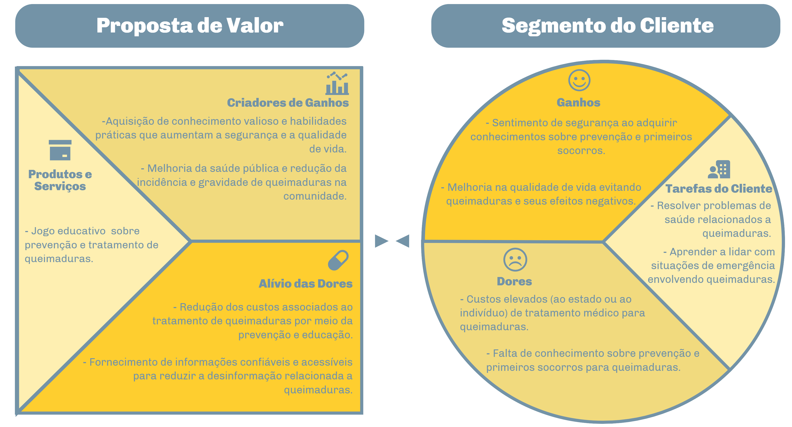
<div align="center">
<sub>Fonte: Material produzido pelos autores (2024)</sub>
</div>

&nbsp;&nbsp;&nbsp;&nbsp;
Após a avaliação da proposta de valor, foi analisado que para aliviar a dor de custos elevados poderia se reduzir os custos associados ao tratamento de queimadura por meio da prevenção e educação. Também percebeu-se que a falta de conhecimento sobre prevenção e primeiros socorros para queimaduras por parte do público é uma das grandes dores da empresa. Por conta disso, fornecer informações confiáveis e acessíveis para reduzir a desinformação relacionada a queimaduras é essencial para aliviar essa dor. Algumas tarefas do cliente abordadas são: resolver problemas de saúde relacionados às queimaduras e aprender a lidar com situações de emergência envolvendo elas. Com isso, decidiu-se oferecer um jogo educativo sobre prevenção e tratamento de queimaduras. Outro fato importante relatado no Canvas, é a seção de ganhos que o cliente receberá, como o sentimento de segurança ao adquirir conhecimentos sobre prevenção e primeiros socorros e a melhoria na qualidade de vida evitando queimaduras no dia a dia, consequentemente colocando pra longe seus efeitos negativos (que são vários). Dito isso também foram listados quais são os criadores desses ganhos, como a aquisição de conhecimento valioso e habilidades práticas que aumentam a segurança e a qualidade de vida do consumidor, junto com a melhoria da saúde pública e redução da incidência e gravidade de queimaduras na comunidade. 

Conclui-se, portanto, que a Proposta de Valor (Canvas) tem papel fundamental para relatar os problemas que o cliente possui, junto com as soluções que a empresa irá oferecer.


### 1.1.5. Matriz de Riscos

&nbsp;&nbsp;&nbsp;&nbsp;
De acordo com publicação da Mestre em Informática (Engenharia de Software) e graduanda em Engenharia de Computação pela Universidade Tecnológica Federal do Paraná (UTFPR), Bianca Minetto Napoleão, no blog [Ferramentas de Qualidade](https://ferramentasdaqualidade.org/matriz-de-riscos-matriz-de-probabilidade-e-impacto/), a Matriz de Risco auxilia na avaliação e visualização dos riscos de um projeto a fim de antecipar, avaliar e responder às adversidades de forma efetiva. Nela, são analisados os riscos identificados, sua probabilidade de ocorrência, os impactos caso ocorram e o plano de ação necessário. A partir disso, a tomada de decisões se torna fluida e, consequentemente, o sucesso do projeto passa a ser mais provável. Na imagem a seguir, foi desenvolvida a matriz de risco avaliando os possíveis riscos durante o desenvolvimento do MVP do módulo 1 no Inteli.

<div align="center">
<sub>Imagem 2 - Matriz de Risco</sub>
</div>
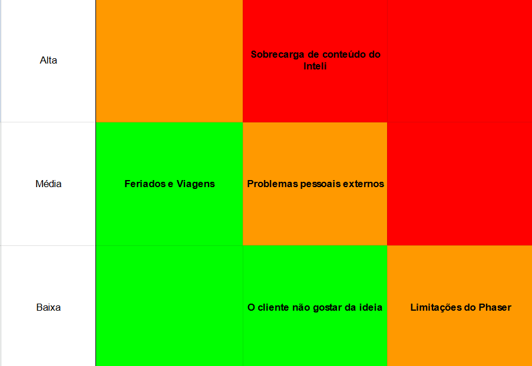
<div align="center">
<sub>Fonte: Material produzido pelos autores (2024)</sub>
</div>

&nbsp;&nbsp;&nbsp;&nbsp;
Diante do que foi concluído entre o grupo, percebeu-se que um dos maiores riscos para o projeto será a sobrecarga de conteúdos por parte da Inteli. Diante disso, urge a necessidade de uma boa gestão de tempo e divisão de tarefas, implementada por meio da gestão ágil. O impacto é médio, dado que pode atrasar o desenvolvimento e até levar os membros do grupo a um burnout.
Problemas pessoais externos também é um problema que não poder ser evitado, mas que deve ser levado em consideração para evitar atrasos no desenvolvimento.
Feriados e viagens é um problema encontrado no projeto, porém não é um problema tão preocupante, dada a possibilidade do desenvolvimento à distância.
No início do projeto, não se sabia até que ponto o Phaser poderia ir. Então o grupo entendeu que as limitações da biblioteca poderiam ser uma ameaça para o desenvolvimento. Entretanto a probabilidade era baixa, dada a quantidade de jogos desenvolvida com o Phaser.

&nbsp;&nbsp;&nbsp;&nbsp;
Após toda essa avaliação sobre a matriz de risco do projeto, pode-se perceber que a maioria dos fatores são de acontecimentos que não podem ser evitados pela equipe (como a sobrecarga de conteúdos, feriados e problemas pessoais externos), toda via a equipe se compromete ao desenvolvimento do projeto, ainda que estes riscos existam.

### 1.1.6. 5 Forças de Porter

&nbsp;&nbsp;&nbsp;&nbsp;
O modelo proposto por Michael Porter em 'Estratégia Competitiva: Técnicas para Análise de Indústrias e da Concorrência' é um instrumento fundamental para análise, onde o foco principal é analisar o ambiente competitivo em que a organização está enquadrada e determinar o melhor posicionamento do negócio diante dos concorrentes. Na imagem a seguir, pode-se observar as 5 forças de Porter desenvolvidas pensando na instituição parceira: Faculdade de Medicina da USP.

<div align="center">
<sub>Imagem 3 - 5 forças de Porter</sub>
</div>
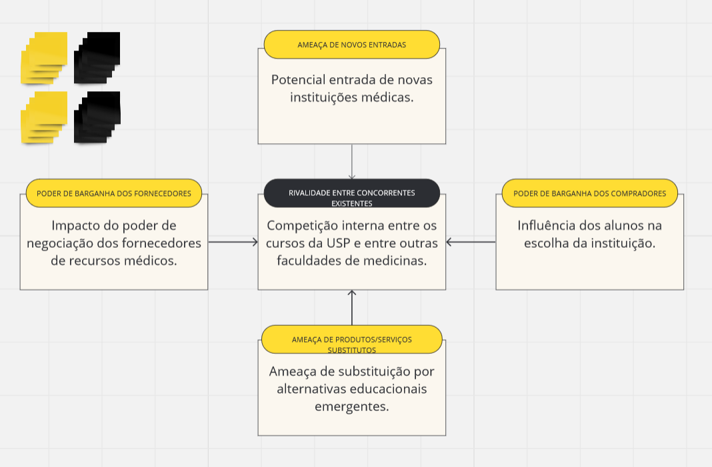
<div align="center">
<sub>Fonte: Material produzido pelos autores (2024)</sub>
</div>

&nbsp;&nbsp;&nbsp;&nbsp;
Pode-se analisar que o poder de barganha dos fornecedores com o impacto do poder de negociação dos fornecedores de recursos médicos não é alto, então eles não tem tanto poder em cima disso. Já no poder de barganha dos compradores, que não são compradores em si, pois são estudantes de uma Universidade pública, o impacto é alto pois se não tiver estudantes para as aulas, a faculdade pode entrar em greve. Analisando a ameaça de novos entrantes, como o potencial de entrada de novas intituições médicas, tende-se a ser uma ameaça grande e constante, pois cada vez mais faculdades novas estão abrindo no mercado, com inovações como diferencial. Já na ameaça de produtos/serviços substitutos, como a alternativa educacional emergente, tende-se a ser uma ameaça média porém não tão constante, pois como a faculdade suporta uma grande quantidade de alunos, a saida de alguns não fará tanta diferença. Por outro lado olhando para a rivalidade entre concorrentes existentes, pode-se listar uma competição interna entre os cursos da USP e entre outras faculdades de medicina, pois mesmo não sendo um curso de medicina, outros cursos como o de farmaceutíca, veterinária e bióloga pode fazer com que os alunos se desinteressem pela medicina, e indo para esses outros cursos.

### 1.1.6. Critérios de sucesso

&nbsp;&nbsp;&nbsp;&nbsp;
Nessa seção serão abordados os critérios usados pelo Double Up para definir o sucesso do projeto. Vale ressaltar que as definições de sucesso são subjetivas de cada indivíduo e projeto. Por conta disso, essa seção estabelece critérios que foram avaliados pelo grupo para formar um padrão de avaliação.

&nbsp;&nbsp;&nbsp;&nbsp;
Para avaliar o sucesso do projeto foram definidos as seguintes métricas: Quantidade de jogadores que indicariam o jogo para outra pessoa; Nível de engajamento do usuário no jogo; e O quanto o usuário aprendeu após jogar. 

&nbsp;&nbsp;&nbsp;&nbsp;
O **índice de recompartilhamento** foi selecionado pois ele corrobora a força do 100° Celsius como uma ferramenta de disseminação de informações sobre a prevenção de queimaduras. 

&nbsp;&nbsp;&nbsp;&nbsp;
O **nível de engajamento do usuário no jogo** indica que o jogo desenvolvido é divertido e engajante, o que o Double UP acredita ser crucial para o sucesso do jogo. Por isso foi, também, selecionado como um critério para alcançar o sucesso do projeto.

&nbsp;&nbsp;&nbsp;&nbsp;
E **o quanto o usuário aprendeu após jogar** é o critério final para o sucesso do projeto. Por ser um jogo com enfoque educativo, 100° Celsius precisa ensinar ao usuário informações para a prevenção de queimaduras. O nível de aprendizado de um jogador define que as táticas utilizadas para ensinar os usuários foram corretamente implementadas.

&nbsp;&nbsp;&nbsp;&nbsp;
Esses critérios serão avaliados por meio de um Google Forms, citado na sprint review 2. O formulário será disponibilizado para os jogadores no próprio jogo, onde eles serão convidados a contribuírem para a melhoria da experiência.

&nbsp;&nbsp;&nbsp;&nbsp;
Estas métricas e ferramentas contribuem para a escalabilidade do projeto, auxiliando na meta de conquistar espaço no mercado de jogos e alcançar cada vez mais pessoas. Fica claro, portanto, o método utilizado pelo grupo para avaliar o sucesso e colher dados para adaptar o jogo no futuro. É a partir disso que o Double UP garante o sucesso futuro e presente do jogo desenvolvido.

## 1.2. Requisitos do Projeto

Entende-se como requisitos do jogo pré-estipulados pela instituição os seguintes tópicos:

<div align="center">
<sub>Tabela B - Requisitos</sub>
</div>

| \#  | Requisito                                                                                                                 |
| --- | ------------------------------------------------------------------------------------------------------------------------- |
| 1   | O jogo deve ser disponibilizado em dispositivos móveis                                                                    |
| 2   | O jogo deverá ter uma linguagem simples e dinâmica                                                                        |
| 3   | Dois modos devem ser disponibilizados: rápido e história                                                                  |
| 4   | O jogador poderá escolher entre dois personagens: Celsinho e Kelvinha                                                     |
| 5   | Dentro do jogo, terá um minigame onde o jogador deve escolher a melhor opção para que possa continuar no jogo principal   |
| 6   | A conscientização sobre os tipos de queimaduras e suas especificidades deverá acontecer                                   |
| 7   | O jogo precisa ter alguma forma de feedback onde os usuários podem avaliar sua experiência e deixar sugestões             |
| 8   | O jogo deve abordar sobre o que não fazer em situações de queimadura e sobre métodos de prevenção                         |
| 9   | O jogo deve conseguir fazer com que os jogadores saiam mais conscientizados sobre o assunto do que estavam antes de jogar |

<div align="center">
<sub>Fonte: Material produzido pelos autores (2024)</sub>
</div>

</br>

&nbsp;&nbsp;&nbsp;&nbsp;
A partir disso, seguindo essas normas, é possível constatar que o jogo será entregue como é esperado e conseguirá cumprir os objetivos da FMUSP para a constituição de uma consciência coletiva mais informada.

## 1.3. Público-alvo do Projeto

&nbsp;&nbsp;&nbsp;&nbsp;
Em primeiro plano, o Double UP foca nos estudantes de escola pública como seu principal público alvo. A escolha se dá pelo seu contexto socio-econômico, dado que pessoas de classes econômicas menos favorecidas são, em suma, os grandes afetados por queimaduras acidentais. Além de que é esse o público que costuma consumir mais jogos digitais.

&nbsp;&nbsp;&nbsp;&nbsp;
Em um segundo momento, a estratégia se volta para a utilização dos jovens como agentes de disseminação de conhecimento. A conscientização atinge não apenas esses estudantes, mas também se propaga para seus pais, amigos e conhecidos. A disseminação ativa do conhecimento cria um efeito cascata, impactando a população em geral. De acordo com dados do Ministério da Saúde, a gravidade do problema é destacada pelos 1 milhão de novos casos anuais de queimaduras, sendo mais de 80% deles evitáveis. A urgência de alcançar um amplo público é ressaltada, enfatizando a necessidade de que as informações cruciais alcancem o maior número possível de pessoas para cumprir o propósito essencial do jogo.

&nbsp;&nbsp;&nbsp;&nbsp;
Percebe-se, portanto, que a estratégia adotada, envolvendo jovens como catalisadores de conscientização, revela-se precisa no combate de um problema de saúde pública tão prevalente. A combinação de educação através de jogos interativos, aliada à capacidade de disseminação por meio da juventude, revela-se uma estratégia poderosa. Ao atingir não apenas o público-alvo inicial, mas expandindo seu impacto para além dessas fronteiras, a iniciativa busca efetivamente reduzir a incidência de queimaduras evitáveis e promover uma compreensão mais abrangente sobre os riscos associados a essa questão de saúde global.

# <a id="c2"></a>2. Visão Geral do Jogo

## 2.1. Objetivos do Jogo

&nbsp;&nbsp;&nbsp;&nbsp;
Em um jogo de corrida com obstáculos, o principal objetivo é desviar do máximo de obstáculos possíveis para chegar cada vez mais longe. E isso não é diferente para 100°C: Corra ou Queime.

&nbsp;&nbsp;&nbsp;&nbsp;
Entretanto, o jogo cria dois objetivos distintos, que variam de acordo com o modo de jogo que o usuário escolheu jogar no dia. No modo história, o objetivo é chegar ao fim de todas as fases sem bater em nenhum obstáculo. Caso o usuário caia no erro de esbarrar em algo, ele terá a chance de evitar a queimadura escolhendo a opção correta nas cenas de prevenção da queimadura. Esta é a maneira que o usuário tem de ir mais longe e completar a fase. Enquanto mostramos a ele o meio correto de prevenir corretamente uma queimadura.

&nbsp;&nbsp;&nbsp;&nbsp;
No modo de jogo rápido, porém, o objetivo é ir cada vez mais longe, dado que a corrida é infinita. A mecânica de ressurreição por meio das cenas de queimadura ocorre da mesma forma que no modo história.

## 2.2. Características do Jogo

### 2.2.1. Gênero do Jogo

&nbsp;&nbsp;&nbsp;&nbsp;
100°C: Corra ou Queime é um runner – jogo de corrida com obstáculos – com elementos de trivia – jogo de responder questões. Essa combinação abre um leque de opções grande para o time de desenvolvimento. Aescolha foi de trazer a diversão dos runners e adicionar a seriedade dos jogos de trivia para mostrar cenários de possíveis queimaduras, desafiando o usuário a impedir que elas ocorram.

### 2.2.2. Plataforma do Jogo

&nbsp;&nbsp;&nbsp;&nbsp;
Visando ser mais cômodo para as apresentações da FMUSP, a Double UP escolheu trabalhar com os dispositivos mobile – celulares android e iphone. E, trabalhando dentro dos limites de desenvolvimento do módulo 1 do Inteli, a aplicação fica no ambiente web. Ou seja, será acessada pelo navegador – principalmente o google chrome.

### 2.2.3. Número de jogadores

&nbsp;&nbsp;&nbsp;&nbsp;
O jogo é desenvolvido para uma experiência individual. Imagina-se que o ambiente solo pode entregar mais conteúdo por pessoa, principalmente por conta do modo história.

&nbsp;&nbsp;&nbsp;&nbsp;
Entretanto, a competição também é algo que incentiva a experiência dos jogadores. Por conta disso, o modo de jogo rápido conta com uma pontuação que pode ser compartilhada com os amigos.

### 2.2.4. Títulos semelhantes e inspirações

&nbsp;&nbsp;&nbsp;&nbsp;
O jogo mistura a experiência de jogo do T-Rex Game, um jogo da Google em que um dinossauro desvia de obstáculos que aparecem no caminho. Esse projeto segue a mesma lógica. No 100°C: Corra ou Queime, os obstáculos são objetos comuns que causam queimaduras.

&nbsp;&nbsp;&nbsp;&nbsp;
E, para completar, foi adicionado um toque de trivia e história interativa, inspirado em jogos como Perguntados, um jogo que desafia o conhecimento do usuário em diversas áreas do conhecimento, e Minecraft Story Mode, que muda as cenas do jogo de acordo com as escolhas do usuário. No jogo 100°C: Corra ou Queime, as escolhas no modo trivia podem prevenir ou causar a queimadura, desafiando o usuário a escolher corretamente – prevenindo-as – e recompensando-o  com um prêmio quando ele acerta.

### 2.2.5. Tempo estimado de jogo

&nbsp;&nbsp;&nbsp;&nbsp;
O jogo está sendo desenvolvido para criar uma experiência dentro e fora da palestra da FMUSP. Espera-se criar fases que durem até 3 minutos, fornecendo informação e diversão em pouco tempo. E, caso o usuário queira se divertir ainda mais, ele pode continuar seguindo com o modo história. No fim, imagina-se que o jogo entregará até 15 minutos de modo história, contando com a duração normal da fase e as trivias.

&nbsp;&nbsp;&nbsp;&nbsp;
No entanto, é de pensamento da equipe que o jogo tem um grande fator diversão. Por isso, foi idealizado o modo de jogo rápido, que fornece a possibilidade de o usuário se desafiar a ir cada vez mais longe em corridas infinitas, desviando dos obstáculos e escolhendo as opções corretas ao entrar nas cenas de prevenção de queimadura.

# <a id="c3"></a>3. Game Design

## 3.1. Enredo do Jogo

**Para o Celsinho**

&nbsp;&nbsp;&nbsp;&nbsp;
Celsinho é um garoto de 12 anos de idade com uma paixão peculiar: ele adora preparar e saborear seu mingau de leite todas as noites. Para ele, não há nada mais reconfortante do que esse ritual culinário que se tornou parte essencial de sua rotina.

&nbsp;&nbsp;&nbsp;&nbsp;
Entretanto, em uma noite aparentemente comum, enquanto preparava seu mingau, um descuido fez com que Celsinho esbarrasse em um cabo de panela, derramando o conteúdo fervente sobre si mesmo. A dor aguda e o susto imediato alertaram sua mãe, que o levou às pressas para o hospital. Felizmente, as queimaduras não eram graves, mas o incidente deixou Celsinho e sua mãe bastante abalados.

&nbsp;&nbsp;&nbsp;&nbsp;
No quarto do hospital, Celsinho, ainda sob o efeito do susto e da dor, adormece e mergulha em um pesadelo vívido: ele se vê impotente diante do perigo iminente que sua família enfrenta em relação às queimaduras. Determinado e movido por um senso de heroísmo intrínseco, Celsinho sabe que não pode simplesmente ficar de braços cruzados enquanto seus entes queridos estão em risco.

&nbsp;&nbsp;&nbsp;&nbsp;
Assim começa a jornada do jovem herói. Armado com coragem e determinação, Celsinho enfrenta desafios ardentes para proteger sua família do perigo das queimaduras. Desde a precaução na casa de seu avô até intervir no churrasco do pai e até mesmo resgatar sua irmãzinha de uma situação potencialmente perigosa, Celsinho se vê confrontado com obstáculos que testam não apenas sua bravura, mas também sua astúcia e habilidade de tomar decisões rápidas.

&nbsp;&nbsp;&nbsp;&nbsp;
À medida que enfrenta cada desafio e protege sua família, Celsinho descobre a importância da prevenção e da segurança na cozinha e em outras situações cotidianas. Seu heroísmo não está apenas em seus atos, mas também em sua capacidade de aprender e ensinar sobre a prevenção de queimaduras.

&nbsp;&nbsp;&nbsp;&nbsp;
Ao final de sua jornada, exausto, mas com o coração cheio de gratidão e aprendizado, Celsinho finalmente encontra a paz para descansar, sabendo que sua família está segura e que ele desempenhou um papel crucial nessa proteção.

**Para a Kelvinha**

&nbsp;&nbsp;&nbsp;&nbsp;
Kelvinha é uma garota de 12 anos com uma paixão peculiar: café com leite. Seus pais nunca entenderam completamente o amor intenso que ela nutria por essa bebida reconfortante. Para Kelvinha, era mais do que uma simples mistura de leite e café; era um ritual sagrado antes de dormir.

&nbsp;&nbsp;&nbsp;&nbsp;
Numa noite particularmente agitada, enquanto preparava sua dose diária de café com leite, Kelvinha esbarrou acidentalmente num cabo de panela, derramando o líquido sobre si mesma. Seus pais, que não assistiram a palestra da FMUSP, improvisaram um tratamento usando borra de café, na esperança de aliviar a queimadura. Infelizmente, não surtiu o efeito esperado.

&nbsp;&nbsp;&nbsp;&nbsp;
Diante da gravidade da situação, Kelvinha foi levada às pressas para o hospital, onde recebeu os cuidados médicos adequados e finalmente conseguiu adormecer. Foi então que mergulhou num sonho surreal.

&nbsp;&nbsp;&nbsp;&nbsp;
No seu sonho, encontrou-se num mundo distorcido, onde seus familiares estavam em perigo iminente de se queimarem. Com uma mistura de medo e determinação, lançou-se numa missão desesperada para salvá-los.

&nbsp;&nbsp;&nbsp;&nbsp;
À medida que enfrentava os desafios do seu pesadelo, Kelvinha começou a compreender a importância da prevenção de queimaduras. Cada ação, cada escolha, moldava-se num aprendizado profundo sobre segurança e cuidado.

&nbsp;&nbsp;&nbsp;&nbsp;
Ao despertar no hospital, Kelvinha recordou-se da dor da queimadura, mas também sentiu uma onda de orgulho ao lembrar-se de como proteger seus entes queridos, mesmo no mundo caótico de seus sonhos. Foi um despertar não apenas para a realidade da sua própria vulnerabilidade, mas também para o poder da prevenção e da coragem em face do perigo.

## 3.2. Personagens

### 3.2.1. Controláveis

&nbsp;&nbsp;&nbsp;&nbsp;
Esta seção tem como propósito apresentar uma descrição minuciosa dos dois personagens controláveis no jogo, abrangendo aspectos como nomes, objetivos, características, habilidades e peculiaridades distintivas. O primeiro deles é denominado Celsinho, enquanto o segundo é denominado Kelvinha.

**Celsinho:**

&nbsp;&nbsp;&nbsp;&nbsp;
Navegue habilmente pelos obstáculos para evitar queimaduras. Celsinho, inspirado no celsius (unidade de temperatura), é o protagonista masculino do jogo. Ele é um jovem explorador pardo que estuda em uma escola pública, onde incidentes de queimaduras são comuns. Uma vez, enquanto Celsinho fazia mingau, sofreu queimaduras ao deixar derramar o conteúdo quente em si mesmo. Motivado pelo desejo de adquirir conhecimento, Celsinho parte em uma jornada. Os jogadores têm a opção de escolhê-lo como seu personagem. 


<div align="center">
<sub>Imagem 4 - Personagem Celsinho </sub>
</div>

<div align="center">

</div>

<div align="center">
<sup>Fonte: Material produzido pelos autores (2024)</sup>
</div>

**Kelvinha:**

&nbsp;&nbsp;&nbsp;&nbsp;
Kelvinha, inspirada no kelvin (unidade de temperatura), é a protagonista feminina do jogo. Ela é uma jovem negra que vive em uma comunidade periférica e busca aprender sobre prevenção de queimaduras. Uma vez, enquanto estava esquentando água para fazer café com leite, ela acabou derramando o líquido fervanete em si e sofreu uma queimadura de primeiro grau. Os jogadores têm a opção de escolher Kelvinha como sua personagem. 
<div align="center">
<sub>Imagem 5 - Personagem Kelvinha </sub>
</div>

<div align="center">
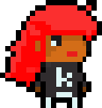
</div>

<div align="center">
<sup>Fonte: Material produzido pelos autores (2024)</sup>
</div>

&nbsp;&nbsp;&nbsp;&nbsp;
Em conclusão, a análise detalhada dos personagens controláveis, Celsinho e Kelvinha, proporciona uma compreensão abrangente das diferentes dimensões que enriquecem a experiência do jogador no jogo em questão. Suas características únicas, objetivos específicos e habilidades distintas contribuem para a diversidade e complexidade do universo do jogo, promovendo uma narrativa envolvente e estratégias diversificadas. Ao explorar as nuances desses personagens, os jogadores têm a oportunidade de mergulhar em um contexto rico, promovendo um envolvimento mais profundo e imersivo com a trama e as mecânicas do jogo.

### 3.2.2. Non-Playable Characters (NPC)

&nbsp;&nbsp;&nbsp;&nbsp;
Nesta seção, serão apresentados os coadjuvantes que dão vida à trama. É aqui que cada personagem secundário será devidamente descrito e ilustrado para que se possa mergulhar ainda mais fundo na história.

**Irmãzinha - Lara (Líquido Quente):**

&nbsp;&nbsp;&nbsp;&nbsp;
Lara é a irmã mais nova da família, uma criança curiosa e ágil. Seus olhos brilham ao olhar objetos brilhantes e liquidos com bolhas — como a água fervendo. Sua cor favorita é lilás. Ela representa um dos públicos muito vitimados por queimaduras por escaldaduras: as crianças.

<div align="center">
<sub>Imagem 6 - Personagem Lara </sub>
</div>

<div align="center">
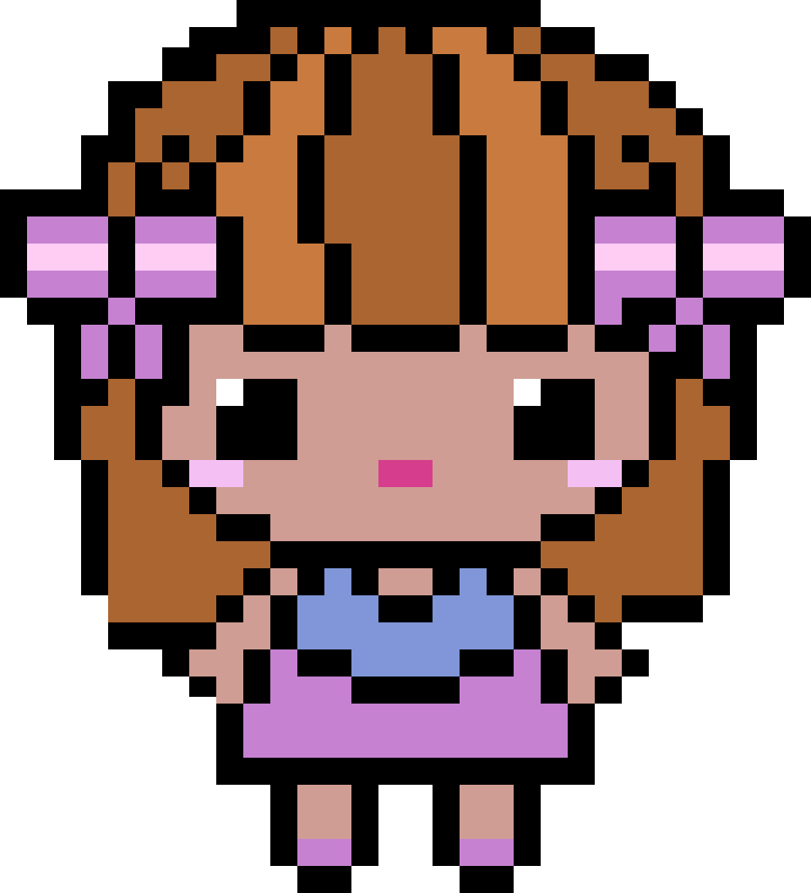
</div>

<div align="center">
<sup>Fonte: Material produzido pelos autores (2024)</sup>
</div>

**Pai - Carlos (Explosões):**

&nbsp;&nbsp;&nbsp;&nbsp;
Carlos é o pai da família, um homem robusto e descontraído. Ele assume a responsabilidade de lidar com a churrasqueira e outros elementos quentes. Vestindo avental e segurando utensílios de churrasco, ele representa outro público muito envolvido em acidentes que resultam em queimaduras: os churrasqueiros da família.

<div align="center">
<sub>Imagem 7 - Personagem Carlos </sub>
</div>

<div align="center">
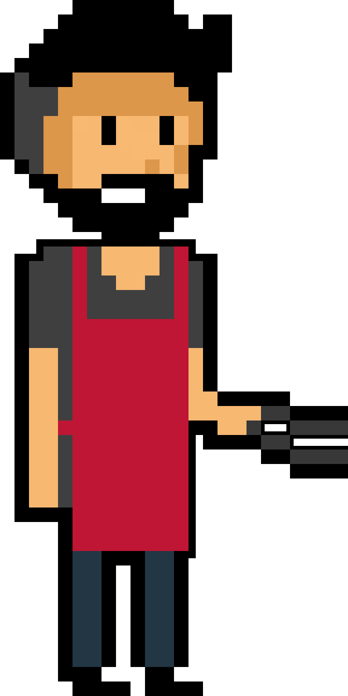
</div>

<div align="center">
<sup>Fonte: Material produzido pelos autores (2024)</sup>
</div>

**Mãe - Marta (Superfície Quente):**

&nbsp;&nbsp;&nbsp;&nbsp;
Marta é a mãe da família, uma mulher prática e multitarefa. Ela enfrenta com bravura as superfícies quentes, mostrando habilidade em manusear ferros e fornos. Seu visual é elegante, com um sorriso alegre e um toque de determinação em seus olhos. Ela representa um público que carrega muitos mitos sobre queimaduras enraizados: as donas do lar.

<div align="center">
<sub>Imagem 8 - Personagem Marta </sub>
</div>

<div align="center">

</div>

<div align="center">
<sup>Fonte: Material produzido pelos autores (2024)</sup>
</div>

&nbsp;&nbsp;&nbsp;&nbsp;
Apresentamos agora os coadjuvantes que enriquecem nossa trama. Acompanhe abaixo a relação detalhada de cada um, destacando sua relevância em cada fase do jogo.

<div align="center">
<sub>Tabela C - Relação personagens e fases </sub>
</div>


| **Fases e Personagens**       | **Participação nas fases**                                            |
| ----------------------------- | --------------------------------------------------------------------- |
| **Fase 1: Explosões**         | Carlos (Pai) - Lida com churrasqueira, chamas e panela de pressão.    |
| **Fase 2: Líquidos Quentes**  | Lara (Irmãzinha) - Enfrenta água fervente, óleo quente e café quente. |
| **Fase 3: Superfície Quente** | Marta (Mãe) - Enfrenta fundos de geladeira, ferro de passar e forno.                   |

<div align="center">
<sup>Fonte: Material produzido pelos autores (2024)</sup>
</div>

&nbsp;&nbsp;&nbsp;&nbsp;
Concluímos, assim, nossa análise dos coadjuvantes, oferecendo uma visão panorâmica de sua importância em cada fase do jogo. A relação entre esses personagens e as etapas da narrativa revela-se como um elemento crucial para a dinâmica e riqueza do enredo.

### 3.2.3. Diversidade e Representatividade dos Personagens

&nbsp;&nbsp;&nbsp;&nbsp;
Como visto nas seções 3.2.1 e 3.2.2, foram criados 5 diferentes personagens: Celsinho e Kelvinha (os personagens principais), Lara, Carlos e Marta (os NPCs). 

&nbsp;&nbsp;&nbsp;&nbsp;
Ao realizar o jogo, o Double UP fez questão de pesquisar os números que representassem a sociedade brasileira, encontrados no censo do IBGE de 2022 da população brasileira. Os números obtidos foram: 45,3% da população são pardos; 43,5% são brancos; e 10,2% são pretos. Nesse contexto, durante a criação dos personagens, levou-se em consideração a grande porcentagem de pessoas negras (pretos e pardos) para construir Celsinho e Kelvinha, ambos negros. Além uma família tipicamente brasileira: muito diversa.

&nbsp;&nbsp;&nbsp;&nbsp;
Concluiu-se, então, que escolher por medidas afirmativas será de grande impacto para o desempenho do jogo no mercado, dado que os usuários, estudantes de escola pública, terão personagens para se identificar e equiparar suas experiências às vivenciadas por eles. Reforça-se, também, o compromisso do Double UP em reduzir a falta de representatividade nos conteúdos de entretenimento consumidos no Brasil. E vale ressalter que a criação da personagem Kelvinha como um dos protagonistas do jogo é um passo largo na luta contra a desigualdade de gênero muito presente no cenário. Por fim, outro aspecto da personagem Kelvinha é a sua forte aparência com um grande cabelo vermelho que irradia grande personalidade, evitando uma representação machista de uma personagem fraca e indefesa utilizada em muitos jogos. Dessa forma, busca-se representar melhor a sociedade no jogo e fazer com que os grupos reprimidos sintam-se acolhidos, ainda que em um jogo educativo.
  
## 3.3. Mundo do jogo

### 3.3.1. Locações Principais e/ou Mapas

&nbsp;&nbsp;&nbsp;&nbsp;
Nesta seção, os detalhes dos dois modos oferecidos no jogo são explorados: "Modo História" e "Modo Rápido". Cada modo proporciona uma experiência única, desafiando os jogadores de maneiras distintas.

&nbsp;&nbsp;&nbsp;&nbsp;
No "Modo História", três mapas envolventes são explorados - Explosões, Líquidos Quentes e Superfície Quente. Cada ambiente é projetado para criar uma atmosfera agitada, repleta de desafios relacionados a elementos quentes. Imagens ilustrativas acompanham as descrições, oferecendo uma projeção do visual do cenário que aguarda os jogadores.

&nbsp;&nbsp;&nbsp;&nbsp;
Já no "Modo Rápido", a emoção de uma corrida pela estrada é destacada, enfrentando três obstáculos distintos que exigem agilidade e destreza para superar.

**Modo história:**

**1. Mapa Explosões - Churrasqueira, Chama, Panela de Pressão:**

&nbsp;&nbsp;&nbsp;&nbsp;
O jogador inicia a jornada em uma varanda doméstica movimentada. Ao redor, a churrasqueira solta faíscas enquanto prepara refeições, chamas abertas, e panelas de pressão liberam vapor com intensidade. A atmosfera é agitada e repleta de desafios.

<div align="center">
<sub>Imagem 9 - Ilustração da fase "Explosões" </sub>
</div>

<div align="center">
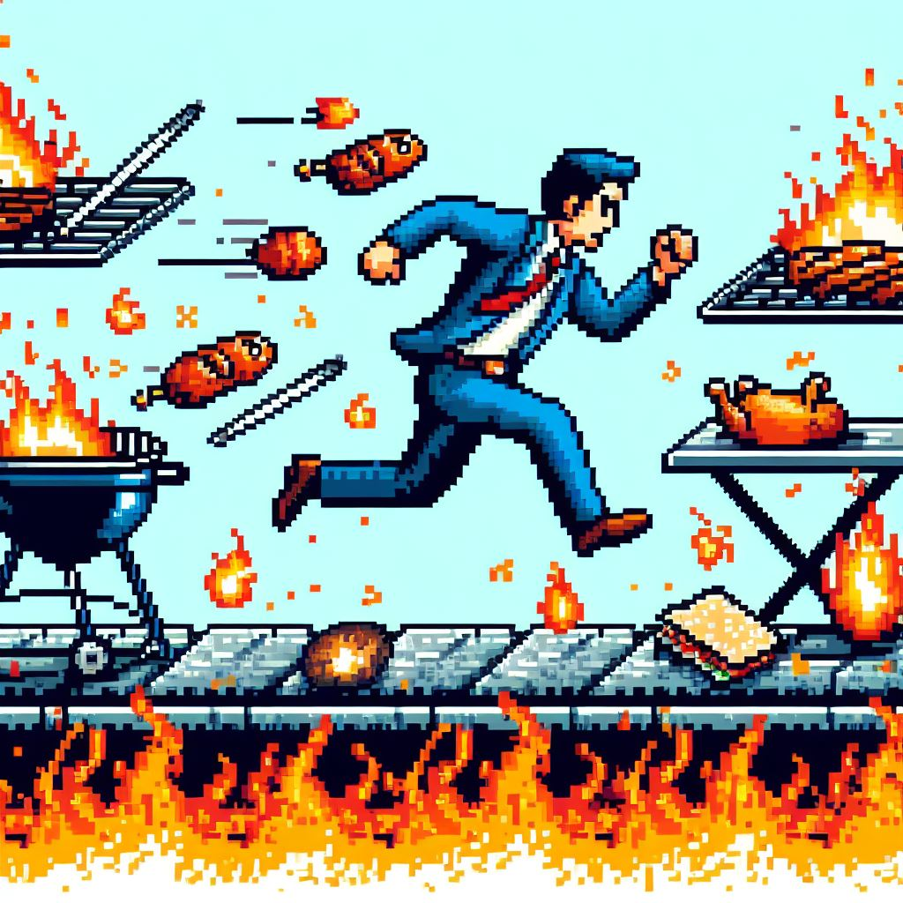
</div>

<div align="center">
<sup>Fonte: Material gerado pelo Bing Copilot AI com tecnologia DALL·E 3 (2024)</sup>
</div>

**2. Mapa Líquidos Quentes - Água Fervente, Óleo Quente, Café Quente (Cafeteira):**

&nbsp;&nbsp;&nbsp;&nbsp;
Avançando, os jogadores enfrentam uma cozinha repleta líquidos quentes. A água fervente enche o ar de vapor, o óleo quente espirra de panelas, e o aroma do café quente permeia o ambiente. A necessidade de evitar queimaduras adiciona tensão ao cenário.


<div align="center">
<sub>Imagem 10 - Ilustração fase da "Líquidos quentes" </sub>
</div>

<div align="center">
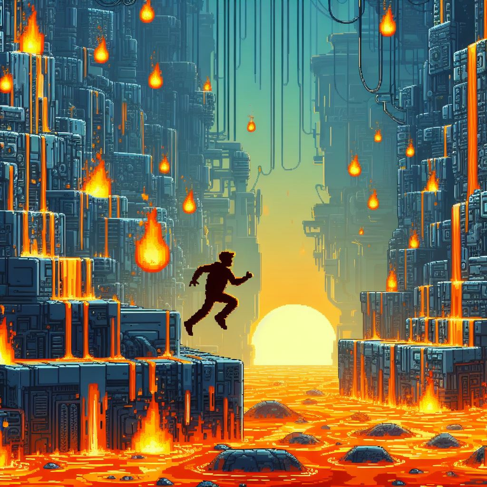
</div>

<div align="center">
<sup>Fonte: Material gerado pelo Bing Copilot AI com tecnologia DALL·E 3 (2024)</sup>
</div>

**3. Mapa Superfície Quente - Frigideira, Forno, Ferro de Passar Roupa:**

&nbsp;&nbsp;&nbsp;&nbsp;
Na fase final, os jogadores enfrentam desafios no resto da casa em ambientes com superfícies quentes. Frigideiras brilham com o calor, fornos apresentam calor extremo e ferros de passar roupa emitem vapor. Navegar por essas áreas exige estratégia para evitar queimaduras.

<div align="center">
<sub>Imagem 11 - Ilustração da fase "Superfície Quente" </sub>
</div>

<div align="center">
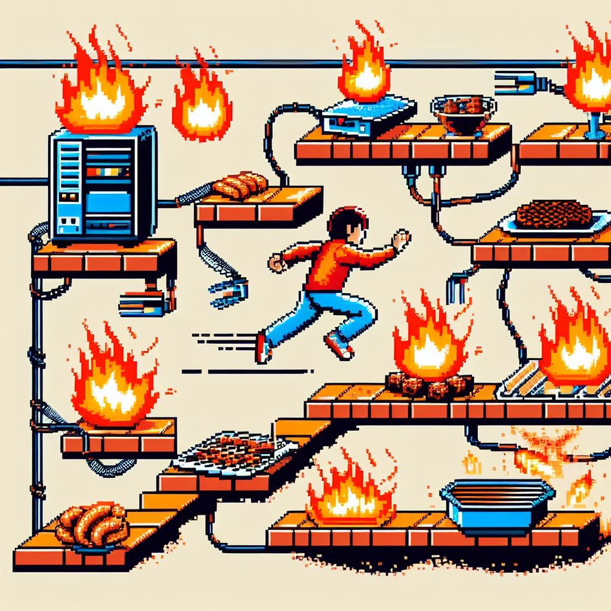
</div>

<div align="center">
<sup>Fonte: Material gerado pelo Bing Copilot AI com tecnologia DALL·E 3 (2024)</sup>
</div>

**Modo Rápido:**

&nbsp;&nbsp;&nbsp;&nbsp;
Em um cenário caótico, o jogador enfrentará desafios diversos, gerados aleatóriamente. O objetivo do modo é ir o mais longe possível e desafiar o jogador cada vez mais ao longo do que ele é capaz de avançar.

<div align="center">
  <sub>Imagem 12 - Ilustração do "Modo Rápido" </sub>
</div>

<div align="center">
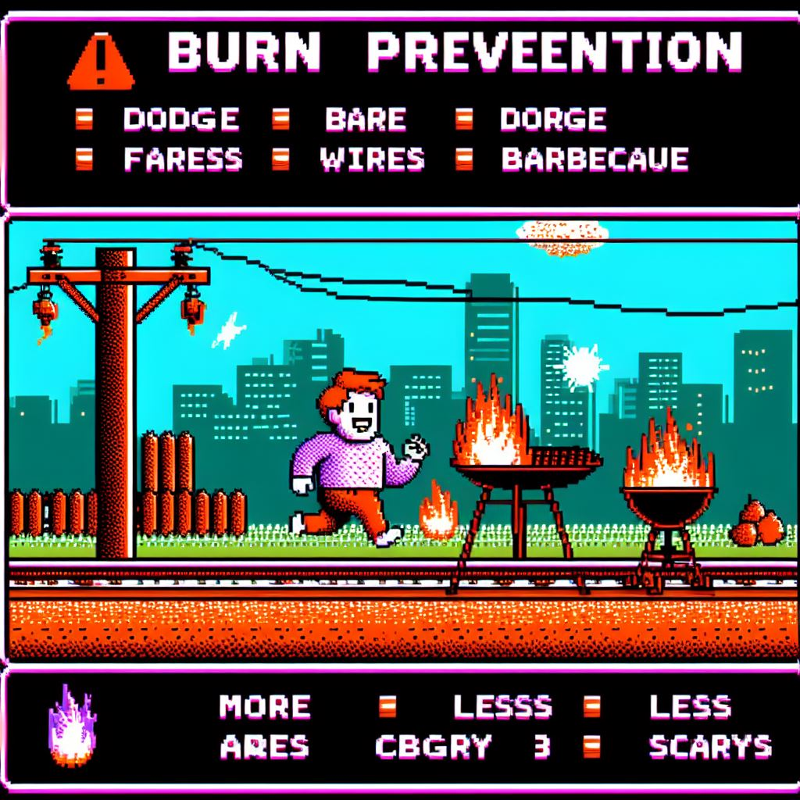
</div>

<div align="center">
<sup>Fonte: Material gerado pelo Bing Copilot AI com tecnologia DALL·E 3 (2024)</sup>
</div>

&nbsp;&nbsp;&nbsp;&nbsp;
Por fim, ao escolher entre a narrativa envolvente do "Modo História" ou a ação acelerada do "Modo Rápido", os jogadores são convidados a mergulhar em um universo cativante que oferece diversidade, conhecimento e entretenimento.

### 3.3.2. Navegação pelo mundo

&nbsp;&nbsp;&nbsp;&nbsp;
Nesta seção, será explorada a experiência de navegação pelo mundo dentro do jogo. Dividido em dois modos distintos - "Modo História" e "Modo Rápido" - o jogo oferece aos jogadores uma variedade de experiências envolventes e desafiadoras. No "Modo História", as intricadas narrativas que conduzem os jogadores através de churrascos e ambientes escaldantes serão mergulhadas, enquanto são destacados elementos educativos sobre prevenção de queimaduras. Por outro lado, o "Modo Rápido" proporciona uma experiência mais acelerada, onde os jogadores enfrentam obstáculos rápidos e intensos, testando suas habilidades em corridas e esquivas. Os diferentes modos oferecem escolhas distintas, adaptando-se ao estilo de jogo de cada jogador e proporcionando um aprendizado leve e divertido. 

**Modo História:**

&nbsp;&nbsp;&nbsp;&nbsp;
No modo história, os jogadores mergulham em uma narrativa envolvente, enfrentando desafios e explorando ambientes temáticos. A história segue a jornada da família em meio a churrascos agitados, líquidos quentes e superfícies escaldantes. Cada fase proporciona uma experiência imersiva à medida que os jogadores superam obstáculos relacionados aos elementos quentes. As fases são interligadas por uma trama que destaca modos de prevenção de queimaduras, criando uma atmosfera educativa.

**Modo Rápido:**

&nbsp;&nbsp;&nbsp;&nbsp;
No modo rápido, os jogadores encaram uma série de obstáculos rápidos e intensos, sem a complexidade de uma narrativa linear. Este modo foca na ação pura, oferecendo uma experiência de jogo mais rápida e direta. Os desafios incluem corridas pela estrada e esquivas de obstáculos específicos. Cada desafio apresenta um conjunto distinto de elementos quentes, testando as habilidades do jogador.

&nbsp;&nbsp;&nbsp;&nbsp;
Ambos os modos, embora diferentes em sua abordagem, convergem para o mesmo propósito: proporcionar aos jogadores escolhas significativas, adaptando-se aos seus estilos preferidos e tornando a experiência de aprendizado leve e divertida. Conclui-se a versatilidade e a cuidadosa concepção por trás da navegação pelo mundo no jogo, esperando que os jogadores desfrutem ao máximo de suas experiências únicas.

<div align="center">
<sub>Tabela D - Relação navegação pelo mundo</sub>
</div>

|          | Modo História | Modo Rápido
|-----------------|-------------|--------
|**Descrição geral** | Os jogadores imergem em narrativas envolventes, enfrentando desafios em ambientes temáticos. A jornada segue a família por churrascos agitados, líquidos quentes e superfícies escaldantes.| Uma série de obstáculos rápidos e intensos, sem uma narrativa linear. Foco na ação pura, oferecendo uma experiência de jogo rápida e direta.
|**Elementos gerais** | Cada fase apresenta desafios relacionados a elementos quentes, como churrascos, líquidos quentes e superfícies escaldantes. | Desafios específicos incluem elementos quentes, testando as habilidades do jogador em corridas e esquivas. 
|**Interligação das fases** | As fases são conectadas por uma trama envolvente que destaca modos de prevenção de queimaduras, criando uma atmosfera educativa. | Cada desafio é independente, sem uma narrativa linear, permitindo aos jogadores focar na ação rápida sem complexidade adicional.
|**Propósito** | Proporcionar uma experiência imersiva e educativa, adaptando-se ao estilo de jogo de cada jogador. | Oferecer ação intensa e rápida, adequada para jogadores que preferem desafios sem a complexidade de uma história.
|**Escolhas Significativas** | Ambos os modos convergem para o mesmo propósito de oferecer escolhas significativas aos jogadores. | Os jogadores têm a liberdade de escolher entre a imersão narrativa do "Modo História" ou a ação acelerada do "Modo Rápido".
|**Aprendizado leve e divertido** | Conclusão destaca a versatilidade e a cuidadosa concepção por trás da navegação no jogo, buscando proporcionar uma experiência de aprendizado leve e divertida. | A variedade de experiências oferecidas nos modos busca tornar o aprendizado mais envolvente e adaptado ao estilo de cada jogador.
<div align="center">
<sup>Fonte: Material produzido pelos autores (2024)</sup>
</div>

</br>

&nbsp;&nbsp;&nbsp;&nbsp;
Em conclusão, a tabela destaca as distintas características entre os modos "História" e "Rápido" no jogo, proporcionando aos jogadores experiências variadas e envolventes. No "Modo História", a imersão narrativa e educativa é realçada por desafios temáticos, enquanto o "Modo Rápido" oferece ação rápida e intensa, sem a complexidade de uma trama linear. A tabela evidencia a flexibilidade do jogo ao adaptar-se aos diferentes estilos de jogo, proporcionando escolhas significativas aos jogadores. Através desses modos distintos, a experiência de aprendizado é projetada para ser leve, divertida e, acima de tudo, adaptada às preferências individuais dos jogadores.

### 3.3.3. Condições climáticas e temporais

&nbsp;&nbsp;&nbsp;&nbsp;
As diferenças climáticas não se aplicam nesse projeto, pois a condição climática é constante ao longo do jogo e não afeta os personagens.

### 3.3.4. Concept Art

&nbsp;&nbsp;&nbsp;&nbsp;
A estética do 100º Celsius é cuidadosamente elaborada para mergulhar os jogadores em uma experiência visualmente cativante, alinhada ao objetivo fundamental de conscientização sobre prevenção de queimaduras. Os personagens principais: Celsinho e Kelvinha, são representados em  pixel art, ressaltando a simplicidade visual que facilita a identificação do público-alvo, composto majoritariamente por jovens.

&nbsp;&nbsp;&nbsp;&nbsp;
A escolha de cores vivas e vibrantes desempenha um papel crucial na estética do jogo. As cores vivas presentes nos cenários – desde a o quintal com a churrasqueira até a cozinha com líquidos quentes e o desafio final em ambientes com superfícies quentes – adicionam vida ao jogo, e também servem como ferramenta eficaz na comunicação das mecânicas e na transmissão de mensagens educativas.

&nbsp;&nbsp;&nbsp;&nbsp;
Quanto aos cenários, as fases foram estrategicamente projetadas para representar agentes nocivos específicos, desde explosões com churrasqueira e chamas até queimaduras por escaldaduras, dada por líquidos quentes na cozinha e superfícies quentes em outras áreas da casa. Cada cenário é uma cuidadosa mescla de desafios e estética, contribuindo para a imersão do jogador na temática da prevenção de queimaduras.

&nbsp;&nbsp;&nbsp;&nbsp;
A estética do 100º Celsius combina pixel art, cores vibrantes e cenários detalhados para criar uma atmosfera visualmente atraente e coerente. Cada escolha estética é guiada pela intenção de facilitar a compreensão do jogo, comunicar eficazmente com o público-alvo e, ao mesmo tempo, transmitir mensagens importantes sobre a prevenção de queimaduras de forma lúdica e envolvente.

*Abaixo estão as concept arts da cenas:*

<div align="center">
  <sub>Imagem 13 - Concept Art da cena inicial do jogo </sub>
</div>
<div align="center">
  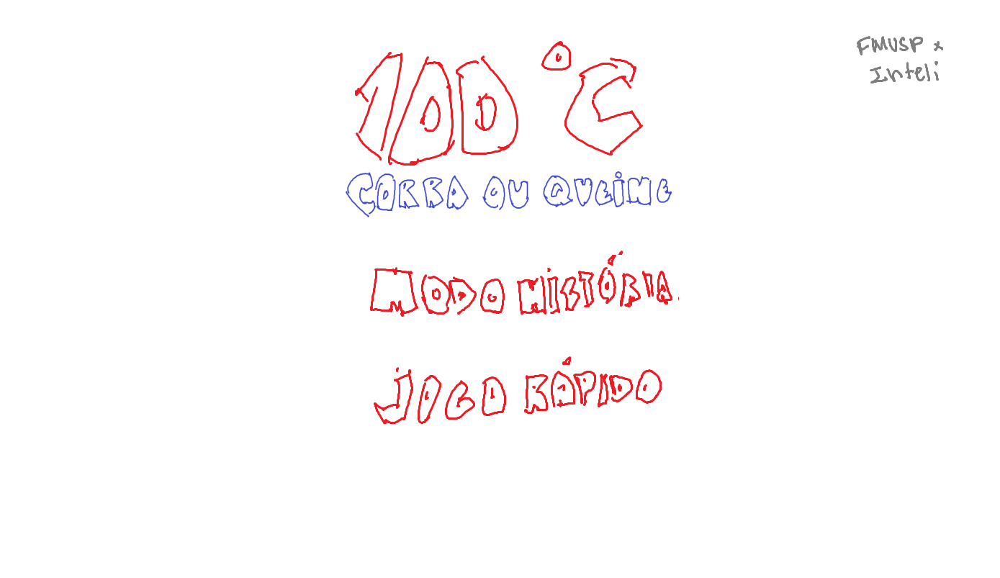
</div>
<div align="center">
  <sup>Fonte: Material produzido pelos autores (2024)</sup>
</div>

<div align="center">
  <sub>Imagem 14 - Concept Art da cena de escolha de personagem </sub>
</div>
<div align="center">
  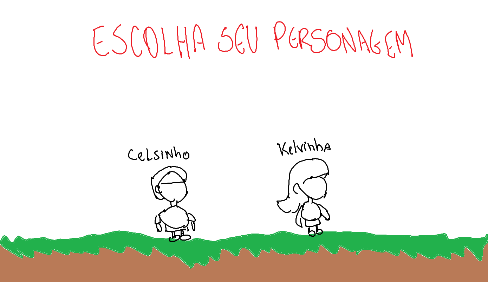
</div>
<div align="center">
  <sup>Fonte: Material produzido pelos autores (2024)</sup>
</div>

<div align="center">
  <sub>Imagem 15 - Elementos de dificuldade de cada fase</sub>
</div>
<div align="center">
  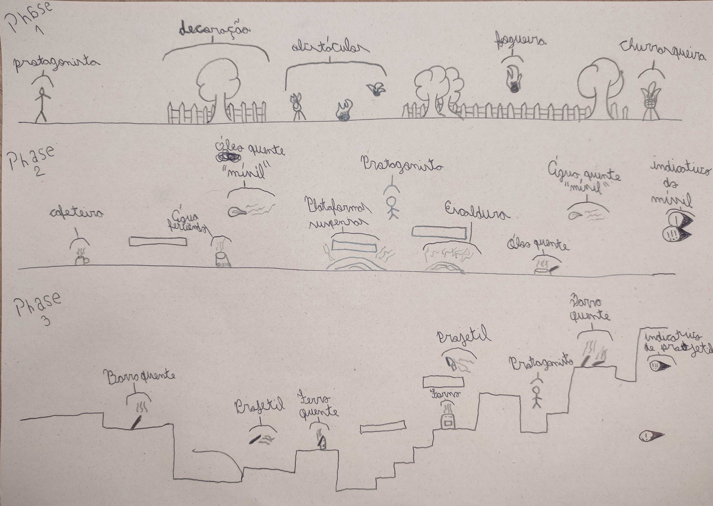
</div>
<div align="center">
  <sup>Fonte: Material produzido pelos autores (2024)</sup>
</div>

<div align="center">
  <sub>Imagem 16 - Primeira Concept Art da cena de Trívia </sub>
</div>
<div align="center">
  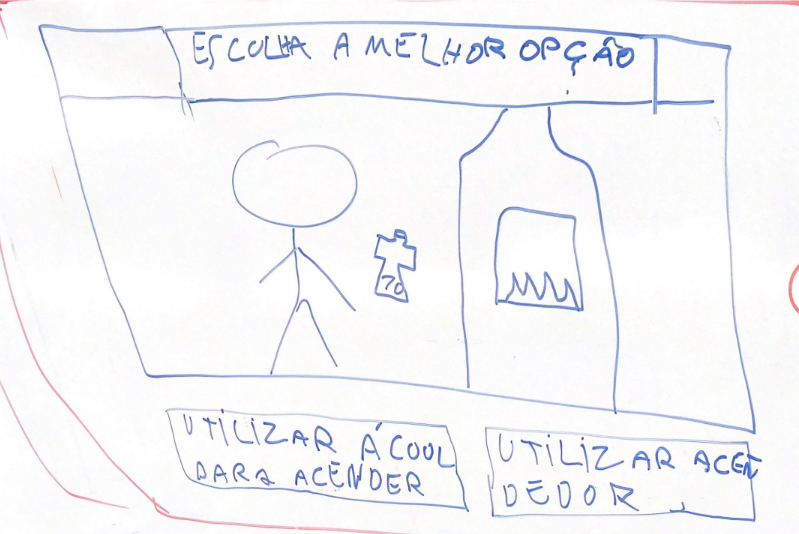
</div>
<div align="center">
  <sup>Fonte: Material produzido pelos autores (2024)</sup>
</div>

<div align="center">
  <sub>Imagem 17 - Concept Art da primeira fase </sub>
</div>
<div align="center">
  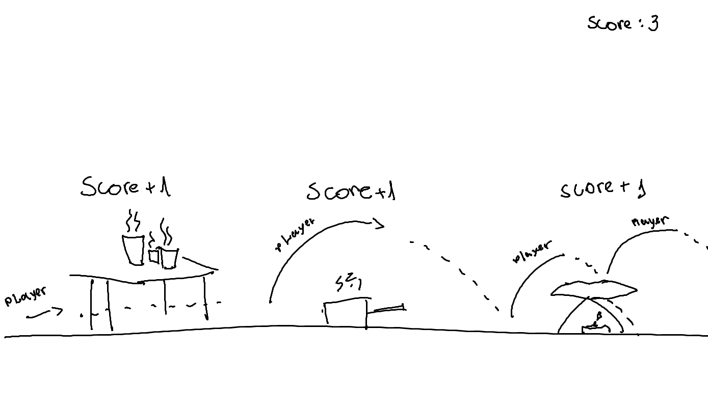
</div>
<div align="center">
  <sup>Fonte: Material produzido pelos autores (2024)</sup>
</div>

<div align="center">
  <sub>Imagem 18 - Concept Art da cena de decisão </sub>
</div>
<div align="center">
  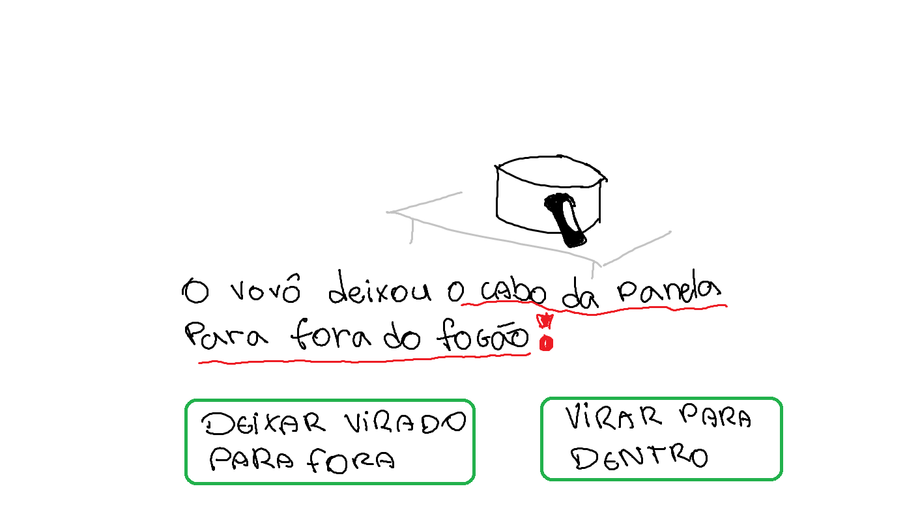
</div>
<div align="center">
<sup>Fonte: Material produzido pelos autores (2024)</sup>
</div>

### 3.3.5. Trilha sonora

&nbsp;&nbsp;&nbsp;&nbsp;
A trilha sonora foi idealizada para ser uma música calma produzida no tipo 8bits, onde passaria uma ideia de suavidez e tranquilidade para o úsuario. Todas as trilhas sonoras do jogo foram feitas por integrantes do grupo. Foi escolhido trabalhar desse modo para ter uma autenticidade a mais no jogo.

<div align="center">
<sub>Tabela E - Trilha sonora</sub>
</div>

\# | Título | Ocorrência | Autoria | link 
--- | --- | --- | --- | ---
1 | Tema de abertura | Ocorre na tela inícial do jogo | própria | [🔗](..\assets\game\startScene\theme.mp3)
2 | Tema do jogo| Ocorre durante as corridas | própria | [🔗](..\assets\game\phase1\musicPhase1.mp3)


<div align="center">
<sub>Fonte: Material produzido pelos autores (2024)</sub>
</div>

## 3.4. Inventário e Bestiário

### 3.4.1. Inventário

&nbsp;&nbsp;&nbsp;&nbsp;
Não se aplica ao projeto.

### 3.4.2. Bestiário
&nbsp;&nbsp;&nbsp;&nbsp;
Nesta seção, são apresentadas informações detalhadas sobre os inimigos presentes no jogo, incluindo seus nomes, imagens associadas, momentos de aparição, funções e impactos no desenvolvimento do jogo.

<div align="center">
<sub>Tabela F - Bestiário</sub>
</div>

| \#  | inimigo           |                                                              | ocorrências        | função                                            | impacto                                                        | efeito sonoro     |
| --- | ----------------- | ------------------------------------------------------------ | ------------------ | ------------------------------------------------- | -------------------------------------------------------------- | ----------------- |
| 1   | Churrasqueira     | 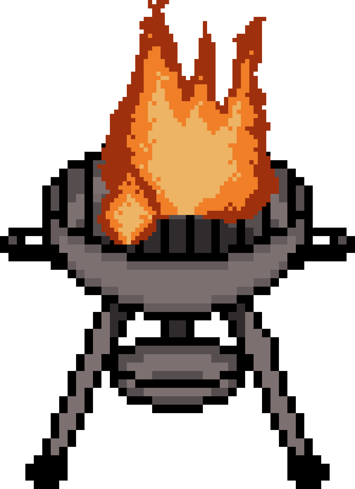   | A partir da fase 1 | É um obstáculo a ser ultrapassado pelo personagem | Se encostar no personagem, ele terá que passar por um minigame | Som de queimadura |
| 2   | Chama             | 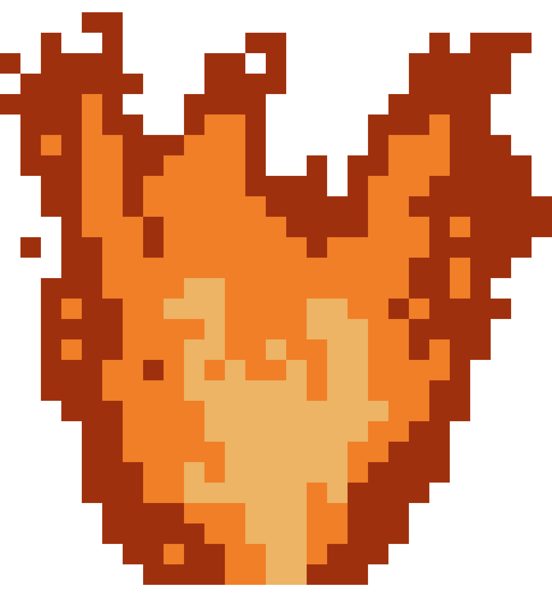           | A partir da fase 1 | É um obstáculo a ser ultrapassado pelo personagem | Se encostar no personagem, ele terá que passar por um minigame | Som de queimadura |
| 3   | Panela de pressão |  | A partir da fase 1 | É um obstáculo a ser ultrapassado pelo personagem | Se encostar no personagem, ele terá que passar por um minigame | Som de queimadura |
| 4   | Panela de água    | 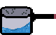    | A partir da fase 2 | É um obstáculo a ser ultrapassado pelo personagem | Se encostar no personagem, ele terá que passar por um minigame | Som de queimadura |
| 5   | Panela de óleo    | 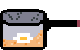    | A partir da fase 2 | É um obstáculo a ser ultrapassado pelo personagem | Se encostar no personagem, ele terá que passar por um minigame | Som de queimadura |
| 6   | Cafeteira         | 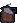       | A partir da fase 2 | É um obstáculo a ser ultrapassado pelo personagem | Se encostar no personagem, ele terá que passar por um minigame | Som de queimadura |
| 7   | Ferro de passar   | 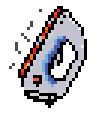   | A partir da fase 3 | É um obstáculo a ser ultrapassado pelo personagem | Se encostar no personagem, ele terá que passar por um minigame | Som de queimadura |
| 8   | Forno             | 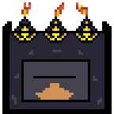           | A partir da fase 3 | É um obstáculo a ser ultrapassado pelo personagem | Se encostar no personagem, ele terá que passar por um minigame | Som de queimadura |
| 9   | Frigideira     | 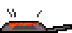    | A partir da fase 3 | É um obstáculo a ser ultrapassado pelo personagem | Se encostar no personagem, ele terá que passar por um minigame | Som de queimadura |

<div align="center">
<sub>Fonte: Material produzido pelos autores (2024)</sub>
</div>

</br>

&nbsp;&nbsp;&nbsp;&nbsp;
No decorrer desta pesquisa, tornou-se evidente que os bestiários desempenham um papel fundamental na construção de mundos ficcionais, oferecendo não apenas entretenimento, mas também servindo como veículos para a transmissão de valores culturais e simbolismos. Foi estabelecido que os três primeiros objetos (churrasqueira, chama e panela de pressão) ficariam restritos à primeira fase do jogo, enquanto os objetos 4, 5 e 6 pertenceriam à segunda fase, e os objetos 7, 8 e 9 seriam introduzidos na terceira fase. Além disso, todos os objetos produzirão um som ao colidirem com o personagem.

## 3.5. Gameflow (Diagrama de cenas)

&nbsp;&nbsp;&nbsp;&nbsp;
O [Diagrama de Cenas](https://www.figma.com/file/NidnhG0pWBBZxgfkwnpfzD/Diagrama-de-cenas?type=whiteboard&t=m4orE3JybetkufXt-1) é uma maneira visual de representar os caminhos do jogador dentro do jogo. Nele, é possível ver os acontecimentos que irão moldar a experiência do jogador ao longo do jogo.

<div align="center">
  <sub>Imagem 19 - Diagrama de Cenas </sub>
</div>
<div align="center">
  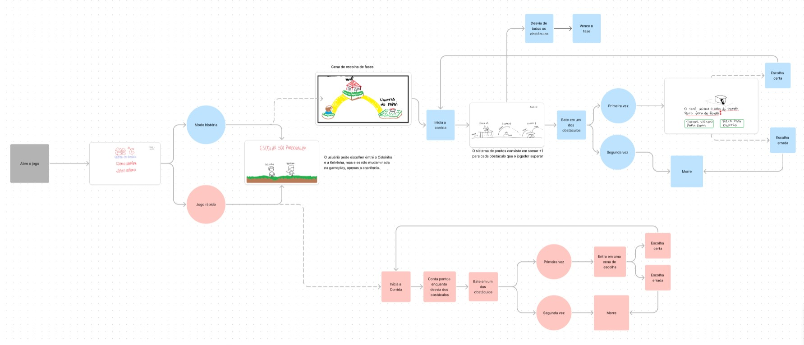
</div>
<div align="center">
<sup>Fonte: Material produzido pelos autores (2024)</sup>
</div>

&nbsp;&nbsp;&nbsp;&nbsp;
No caso do grupo DoubleUp, o diagrama mostra dois caminhos diferentes (Azul e Vermelho), que são os dois modos de jogo (Modo História e Modo Rápido, respectivamente).

&nbsp;&nbsp;&nbsp;&nbsp;
No caso do Modo História, fala-se sobre seleção de fase e os acontecimentos que levam o jogador a vencer uma fase. A ideia de vitória é passar por todos os obstáculos da fase sem tomar dano. Caso o usuário tome dano, ele tem uma chance de continuar a corrida, tendo que resolver um desafio sobre prevenção de queimaduras. E, caso o usuário passe pela fase perfeitamente, ele verá a cena da queimadura sendo prevenida.

&nbsp;&nbsp;&nbsp;&nbsp;
No Modo Rápido, o usuário participa de uma corrida intensa, concorrendo por pontos que escalam de acordo com a distância que o usuário percorre sem sofrer dano. Se ele sofrer dano, também terá uma chance de continuar a corrida, igual no modo história. O diferencial é que o Modo Rápido não tem um fim e o usuário joga para conseguir mais pontos.

&nbsp;&nbsp;&nbsp;&nbsp;
Essas informações ficam visualmente dispostas no Diagrama de Cenas acima, mostrando os caminhos que o usuário pode tomar de acordo com as suas ações.

## 3.6. Regras do jogo

&nbsp;&nbsp;&nbsp;&nbsp;
No contexto deste jogo de plataforma, a habilidade do jogador em desviar de obstáculos se torna crucial para avançar pelas fases. O desafio principal reside na superação desses impedimentos, mas uma reviravolta interessante ocorre quando o jogador falha em evitar um obstáculo específico, desencadeando a entrada em um minigame. Este elemento adiciona uma camada adicional de complexidade e estratégia ao jogo.

&nbsp;&nbsp;&nbsp;&nbsp;
Quando o jogador atinge um obstáculo, ele é conduzido para a trivia, exigindo que a situação de possível queimadura seja evitada para vencer. A vitória na trivia permite a continuidade no jogo de plataforma, mantendo o jogador imerso na experiência e entregando-o um feedback positivo de que a medida tomada é a correta. No entanto, a derrota o leva de volta ao início da fase, incentivando-o a aprimorar suas habilidades e a entender como se prevenir da queimadura para poder passar da fase.

&nbsp;&nbsp;&nbsp;&nbsp;
A conclusão bem-sucedida das três fases representa a vitória global no jogo. A estrutura única, envolvendo desvios de obstáculos e minigames estratégicos, adiciona uma dinâmica cativante à experiência do jogador. A narrativa do jogo se desenrola não apenas por meio da habilidade física do jogador no jogo de plataforma, mas também por suas escolhas e decisões estratégicas nos minigames. Este formato desafiador e envolvente cria uma experiência de jogo intrigante, onde a vitória final é alcançada não apenas através da destreza, mas também da astúcia e da capacidade de tomar decisões que previnam queimaduras.

## 3.7. Mecânicas do jogo

&nbsp;&nbsp;&nbsp;&nbsp;
Por mecânica, entendem-se controles que comandam as ações do jogador dentro da aplicação. Pelo jogo ser do tipo runner –  jogo de corrida com obstáculos – os principais comandos são para desviar dos desafios do mapa. Além disso, o jogo também conta com momentos de trivia, onde o jogador é desafiado solucionar um cenário de possível queimadura, escolhendo a melhor opção para evitar que a vítima se queime. Caso o jogador responde corretamente, ele ganha um "Reviver". Se responder errado, ele perde.

<div align="center">
<sub>Tabela G - Relação mecânicas do jogo </sub>
</div>

| Mecânicas || 
|---|---|
| Pulo | Um botão representado por uma seta para cima. Usado para desviar de obstáculos que se encontram no chão.
| Agachar | Um botão representado por uma seta para baixo. Usado para desviar de obstáculos que estão em plataformas elevadas.
| Reviver | Um prêmio entregue ao usuário quando ele responde a uma pergunta corretamente. Faz o usuário retornar a corrida quando sofre dano.

<div align="center">
<sup>Fonte: Material produzido pelos autores (2024)</sup>
</div>

Essas são as principais funcionalidades do jogo, as quais o jogador terá que entender e dominar para superar os desafios de cada fase.

# <a id="c4"></a>4. Desenvolvimento do Jogo

## 4.1. Desenvolvimento preliminar do jogo
<div align="center">
  <sub>Imagem 20 - GIF de demonstração preliminar do jogo </sub>
</div>
<div align="center">
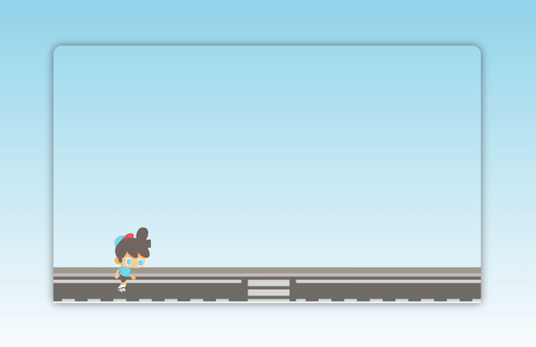
</div>
<div align="center">
<sup>Fonte: Material produzido pelos autores (2024)</sup>
</div>

&nbsp;&nbsp;&nbsp;&nbsp;
Na primeira sprint, foi entregue a parte principal do jogo, onde haverá a maior interatividade com o usuário. Por enquanto, toda a cena foi implementada em um único arquivo index.js, mas há planos de dividir em outros arquivos .js para melhorar a organização e limpeza do código no futuro.

&nbsp;&nbsp;&nbsp;&nbsp;
Uma dificuldade inesperada foi encontrada ao lidar com a construção de sprites. Embora uma quantidade considerável esteja disponível na internet, integrar sprites e tiles de diferentes origens não resultou em uma harmonia adequada, seja por questões estéticas ou funcionais.

&nbsp;&nbsp;&nbsp;&nbsp;
Em resumo, percebeu-se que serão enfrentados desafios não apenas na criação de códigos para enriquecer a cena e desenvolver outras partes do jogo, mas também na confecção dos próprios sprites.

&nbsp;&nbsp;&nbsp;&nbsp;
Os próximos passos envolvem aprimorar a organização do código, resolver questões estéticas e funcionais relacionadas aos sprites e tiles, e desenvolver outras cenas do jogo.


## 4.2. Desenvolvimento básico do jogo

&nbsp;&nbsp;&nbsp;&nbsp;
No contexto do desenvolvimento de jogos, esta seção tem por objetivo inicial apresentar um vídeo abrangente que ilustra a totalidade do jogo em questão. Em seguida, serão detalhados passo a passo o procedimento de desenvolvimento e a estruturação do jogo, proporcionando uma compreensão abrangente do processo criativo e técnico envolvido.

<div align="center">
  <sub>Imagem 21 - GIF de demonstração do jogo </sub>
</div>
<div align="center">
  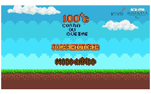
</div>
<div align="center">
<sup>Fonte: Material produzido pelos autores (2024)</sup>
</div>

&nbsp;&nbsp;&nbsp;&nbsp;
Durante o desenvolvimento da versão básica do jogo, foi necessário aprender a utilizar as cenas do software Phaser para que, assim, fosse possível atingir uma melhor organização nos documentos. Feito isso, começou-se a implementar as sprites oficiais no jogo, como a de Celsinho e suas animações de correr e pular. 

~~~javascript
// add o jogador
celsinho = this.physics.add.sprite(100, 300, 'celsinhoRun');
this.physics.add.collider(celsinho, ground);

this.anims.create({
  //Cria a animação do celcinho correndo
  key: 'run' 
  frameRate: 7,
  frames: this.anims.generateFrameNumbers('celsinhoRun', {
    start: 0,
    end: 3,
  }),
  repeat: -1,
});

this.anims.create({
  // Cria a animação do celcinho pulando
  key: 'jump',
  frameRate: 7,
  frames: this.anims.generateFrameNumbers('celsinhoJump', {
    start: 0,
    end: 1,
  }),
});
~~~
&nbsp;&nbsp;&nbsp;&nbsp;
Além disso, foi feito com que Celsinho tivesse uma velocidade constante para a direita e que a câmera o seguisse, centralizando-o até o fim do mapa. Essa mudança foi realizada para que o jogo se encaixasse no ideal proposto pela equipe, no qual o jogador aparenta constantemente estar em uma emergência em que todo segundo importa, retirando a habilidade de parar e pensar.

~~~javascript
// configura a câmera para seguir o jogador
this.cameras.main.startFollow(celsinho, true, 0.05, 0.05, -400); // A câmera fica mais a direita do jogador

celsinho.body.velocity.x = 300; //velocidade do celsinho é constante

~~~

&nbsp;&nbsp;&nbsp;&nbsp;
Fora da jogabilidade, também foram incluídas no jogo as telas pré-jogo, como a tela de início/seleção de modo e a tela de seleção de personagem, sendo todas interativas e com animações. Respectivamente, a primeira tela é usada para introduzir o jogo ao jogador, apresentando-lhe as opções de modo de jogo, e a segunda tela é usada para que o usuário escolha o seu personagem de interesse, em que, futuramente, cada um terá sua habilidade própria.

<div align="center">
  <sub>Imagem 24 - Tela Inicial </sub>
</div>
<div align="center">
  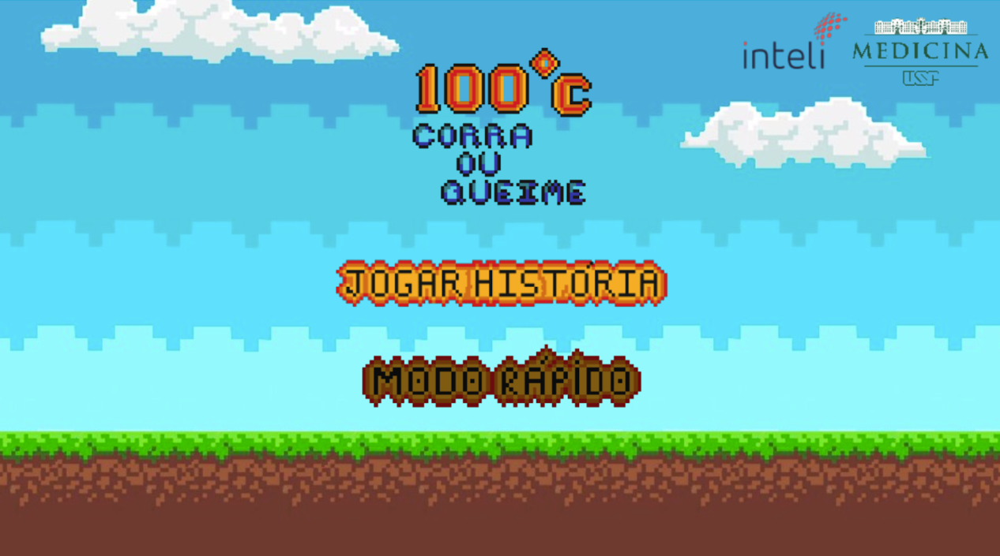
</div>
<div align="center">
<sup>Fonte: Material produzido pelos autores (2024)</sup>
</div>

<div align="center">
  <sub>Imagem 25 - Tela de escolha personagem </sub>
</div>
<div align="center">
  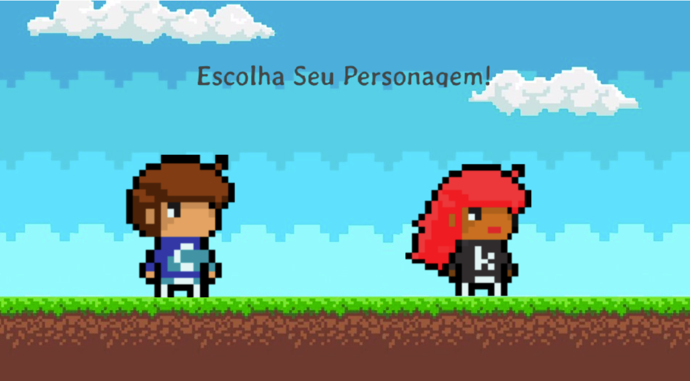
</div>

<div align="center">
<sup>Fonte: Material produzido pelos autores (2024)</sup>
</div>

As cenas foram organizadas da seguinte forma: 
~~~javascript
scene: [StartScene, chooseCharacter, GameScene] // add cenas
~~~

&nbsp;&nbsp;&nbsp;&nbsp;
As cenas estão em ordem, e a seguir o código de troca de cena do StartScene para o chooseCharacter como exemplo:

~~~javascript
// Add um evento de clique no botão 'Modo história'
startHistory.on('pointerdown', () => {
  this.scene.stop('StartScene')// Acaba essa cena
  this.scene.start('chooseCharacter') // comeca a cena 
});
~~~

&nbsp;&nbsp;&nbsp;&nbsp;
A seguir, a lógica utilizada para fazer com que Celsinho pulasse no jogo. A ideia foi criar um sistema que verificasse o estado de Celsinho como onGround ou onAir, dessa forma podendo atribuir ações a essas condições de estado.

~~~javascript
update() {
  // sistema de movimentação
  if (celsinho.y > 360) {
    state = 'onGround';
  } else {
    state = 'onAir';
  }

  if(
    (teclado.up.isDown && state === 'onGround') ||
    (teclado.space.isDown && state === 'onGround')
  ) {
    celsinho.play('jump', true);
    celsinho.setVelocityY(-250);
  } else if (state === 'onGround') {
    celsinho.play('run', true);
  } else if (teclado.down.isDown) {
    celsinho.setVelocityY(+300);
  }
}
~~~

&nbsp;&nbsp;&nbsp;&nbsp;
Por fim, o fundo do nosso jogo em que cada elemento foi separado em camadas para que, futuramente, seja feito um efeito parallax, assim melhorando a experiência geral do jogo ao torná-lo visualmente mais agradável para o usuário.

~~~javascript
sky = this.add.tileSprite(3100, 270, 6216, 540, 'sky');
cloud = this.add.tileSprite(3100, 270, 6216, 540, 'cloud');
cerca = this.add.tileSprite(3100, 300, 6216, 540, 'trees');
trees = this.add.tileSprite(3100, 300, 6216, 540, 'trees');
ground = this.physics.add.staticSprite(3100, 500, 'ground');
~~~

&nbsp;&nbsp;&nbsp;&nbsp;
Ao longo do processo, algumas dificuldades apareceram, como eventuais dificuldades em traduzir nossas ideias da cabeça para o programa. Para além disso, meras falhas técnicas foram bastante recorrentes, resultando em pequenos atrasos. Tais dificuldades surgiram devido à inexperiência com o framework do Phaser e o JavaScript. Exemplos práticos das dificuldades que ocorreram foram: problemas com as animações do personagem; problemas com as transições de uma cena para a outra; problemas ao tentar impedir que o mapa fosse finito; entre diversos outros.

&nbsp;&nbsp;&nbsp;&nbsp;
Os próximos passos para o próximo sprint são: tornar o mapa mais extenso (ou infinito); adicionar obstáculos que surjam ocasionalmente; tornar o jogo reiniciável; adicionar o efeito parallax na tela inicial; entre outros.

## 4.3. Desenvolvimento intermediário do jogo

&nbsp;&nbsp;&nbsp;&nbsp;
No desenvolvimento intermediário do jogo, foram realizadas melhorias significativas para tornar o código mais moderno e eficiente, de acordo com as convenções de módulos do ES6, a mais recente versão do JavaScript. Essas mudanças foram implementadas visando aprimorar a performance do jogo e reduzir a repetição de código desnecessária.

Antigo:
```HTML
<!DOCTYPE html>
<html lang="pt-br">
  <head>
    <meta charset="UTF-8" />
    <meta name="viewport" content="width=device-width, initial-scale=1.0" />
    <link rel="stylesheet" href="style/style.css" />
    <script src="scripts/phaserMin.js"></script>
    <title>100º Celsius</title>
  </head>
  <body>
    <script src="scripts/startScene.js"></script>
    <script src="scripts/chooseCharacter.js"></script>
    <script src="scripts/phases/phase1.js"></script>
    <script src="scripts/phases/phase2.js"></script>
    <script src="scripts/phases/phase3.js"></script>
    <script src="scripts/gameConfig.js"></script>
  </body>
</html>
```

Ao comparar o código antigo com o novo, fica evidente o progresso alcançado. No código antigo, havia uma repetição excessiva de funções, o que tornava o código ineficiente e difícil de manter. Por outro lado, o novo código apresenta uma organização mais coesa e otimizada.


Novo:
```HTML

<!DOCTYPE html>
<html lang="pt-br">
  <!-- "lang" define o idioma do site -->
  <head>
    <!-- Aceita caracteres acentuados -->
    <meta charset="UTF-8" />
    <!-- tag para melhorar a responsividade do site -->
    <meta name="viewport" content="width=device-width, initial-scale=1.0" />
    <link rel="stylesheet" href="style/style.css" />
    <!-- Chamada ao arquivo .css com a estilização da página -->
    <script src="scripts/phaserMin.js"></script>
    <!-- Chamada à biblioteca Phaser -->
    <title>100º Celsius</title>
    <!-- Título do site -->
  </head>
  <body>
    <!-- script principal do jogo, onde a classe phaser é instanciada e tudo é configurado -->
    <script type="module" src="scripts/main.js"></script>
  </body>
</html>

```
A estrutura do código foi simplificada e otimizada para garantir uma melhor interação entre os diferentes arquivos do jogo. Apenas os arquivos necessários para a interação estão indexados, evitando assim a comunicação desnecessária entre scripts e melhorando a eficiência global do código.


Um exemplo notável de melhoria é a criação da classe "player", responsável por manipular o personagem principal do jogo. Essa classe centraliza a carga de sprites e a criação de animações, evitando a repetição de código e tornando o código mais eficiente.


``` javascript

import StartScene from "./startScene.js";
import ChooseCharacter from "./chooseCharacter.js";
import Phase1 from "./phases/phase1/phase1.js";
import Phase2 from "./phases/phase2/phase2.js";
import Phase3 from "./phases/phase3/phase3.js";
```
Um trecho de código exemplar do novo desenvolvimento é a função animsCreate, responsável por criar as animações do jogo de forma organizada e eficiente. Essa função verifica a existência das animações antes de criá-las, evitando conflitos e garantindo um funcionamento suave do jogo.

``` javascript

// Cria as animações do personagem
export function animsCreate(scene) {
  const animationsData = {
    celsinho: {
      Idle: { end: 1 },
      Run: { end: 3 },
      Jump: { end: 1 },
      Squat: { end: 1 },
    },
    kelvinha: {
      Idle: { end: 1 },
      Run: { end: 3 },
      Jump: { end: 2 },
      Squat: { end: 2 },
    },
  };

  Object.keys(animationsData).forEach((character) => {
    Object.keys(animationsData[character]).forEach((animation) => {
      const { end } = animationsData[character][animation];
      let repeat = -1;
      let shouldCreateAnimation = true;

      if (animation === "Squat" || animation === "Jump") repeat = 0; // ajuste para animações "Squat" ou "Jump"

      Object.keys(scene.anims.anims.entries).forEach((entryKey) => {
        if (`${character}${animation}` == entryKey) {
          shouldCreateAnimation = false;
        }
      });

      if (shouldCreateAnimation) {
        scene.anims.create({
          key: `${character}${animation}`,
          frameRate: 7,
          frames: scene.anims.generateFrameNumbers(`${character}${animation}`, {
            start: 0,
            end: end,
          }),
          repeat: repeat,
        });
      }
    });
  });
}


```
Essas melhorias contribuem significativamente para a evolução do jogo, tornando-o mais robusto, eficiente e fácil de manter no longo prazo.


## 4.4. Desenvolvimento final do MVP

Durante a sprint 4, o objetivo do grupo foi desenvolver o Produto Mínimo Viável — MVP é a sigla em inglês. Em linhas gerais, o Double devia entregar um jogo com todas as suas funcionalidades operando. Sendo assim, segue o resumo do que foi feito nas duas semanas.

Em primeiro plano, o grupo focou em implementar o funcionamento das trivias, momento em que o jogador é exposto ao conteúdo de conscientização do jogo. O desafio foi implementar uma cena ocorrendo em sobreposição à outra, este foi superado pelo grupo. E este foi o resultado:

<div align="center">
  <sub>Imagem 26 - Demonstração da trivia </sub>
</div>
<div align="center">
  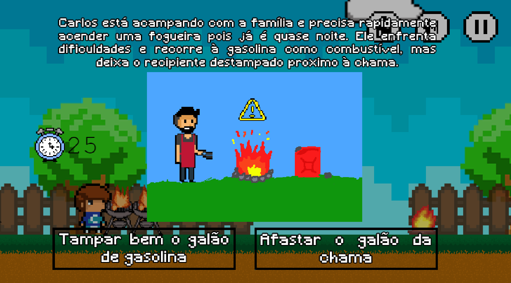
</div>
<div align="center">
<sup>Fonte: Material produzido pelos autores (2024)</sup>
</div>

Para implementar tal ferramenta, o Double Up desenvolveu uma nova cena: [a cena de trivia](../scripts/trivia.js). Operando com um sorteador que chama uma cena aleatória quando o jogador acerta um obstáculo. 

Em outro plano, seguiu-se o desenvolvimento do jogo no ambiente mobile — requisito definido pela Faculdade de Medicina da USP. Nesse contexto, o Double UP enfrentou desafios em criar uma interface funcional para os usuários mobile. No fim o resultado superou as expectativas do grupo, resultando em um jogo fácil de se entender e, ao mesmo tempo, muito desafiador.

Um grande desafio associado à integração do usuário mobile foi o espaço disponível na tela e a disposição das informações no HUD do jogo. Para solucionar a falta de espaço, o Double UP desenvolveu um sistema de movimentação inovador e pouco visto no mercado.

A movimentação do personagem é comandada por áreas (direita e esquerda) onde este faz o personagem agachar, enquanto aquele faz o personagem pular. Assim, sem criar botões desnecessários que ocupavam espaço na tela, o grupo entregou as ferramentas de controle necessárias para o jogador.

<div align="center">
  <sub>Imagem 27 - Demonstração do jogo </sub>
</div>
<div align="center">
  
</div>
<div align="center">
<sup>Fonte: Material produzido pelos autores (2024)</sup>
</div>

Alguns outros detalhes foram alterados no funcionamento do jogo. Sendo eles o posicionamento das bestas, que passou a ser mecânico, proporcionando a possibilidade de criar fases mais bem planejadas. A inserção de um tutorial para o usuário aprender a usar os comandos do jogo antes de ser desafiado. A inclusão de um novo botão de pause, não presente nas sprints passadas. O grupo também adicionou diálogos ao final da fase, para que outros ensinamentos sejam passados além das trivias. 

Fica claro, então, o que foi criado no jogo durante a sprint 4. O Double UP avançou, e muito, com o desenvolvimento do jogo, implementando features cruciais para o produto que agregam na meta do projeto: desenvolver um jogo divertido e educativo.

## 4.5. Revisão do MVP

&nbsp;&nbsp;&nbsp;&nbsp;
Nesta fase final do desenvolvimento do projeto, a equipe da Double Up concentrou-se principalmente em aprimorar o código para garantir a melhor experiência possível ao usuário final. Inicialmente, dedicamos atenção especial à questão da responsividade, visando criar um ambiente adaptável às diferentes telas dos dispositivos utilizados. Para isso, implementamos o recurso "Phaser.Scale.SMOOTH" nas configurações gerais do jogo, que busca manter as proporções e redimensionar o conteúdo de forma sutil, garantindo uma experiência visualmente harmoniosa em diversos dispositivos.

&nbsp;&nbsp;&nbsp;&nbsp;
Além disso, visando melhorar a jogabilidade em dispositivos móveis, incluímos uma mensagem incentivando o jogador a utilizar o celular no modo paisagem. Essa medida visa otimizar a interação com o jogo em telas menores, proporcionando uma experiência mais imersiva e confortável para o usuário.

``` javascript
  scale: {
    mode: Phaser.Scale.SMOOTH,
  },

```

<div align="center">
  <sub>Imagem 28 - Jogo no dispositível móvel colocado na vertical </sub>
</div>
<div align="center">
  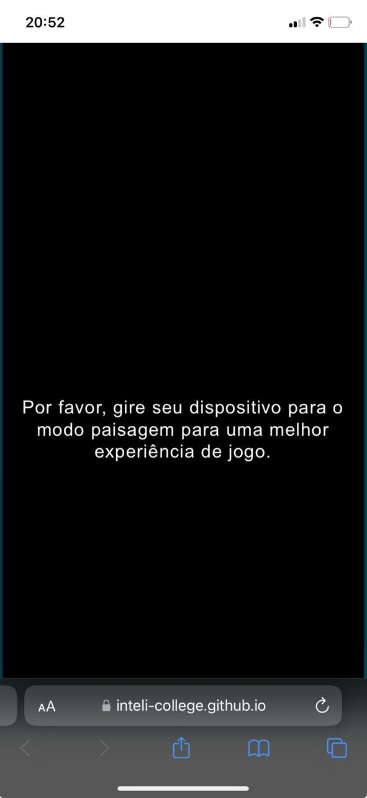
</div>
<div align="center">
<sup>Fonte: Material produzido pelos autores (2024)</sup>
</div>

&nbsp;&nbsp;&nbsp;&nbsp;
Implementamos um recurso que adiciona imagens à tela de seleção de fases e introduz funcionalidades específicas ao pressionar o botão correspondente a cada fase.

<div align="center">
  <sub>Imagem 29 - Tela de fases </sub>
</div>
<div align="center">
  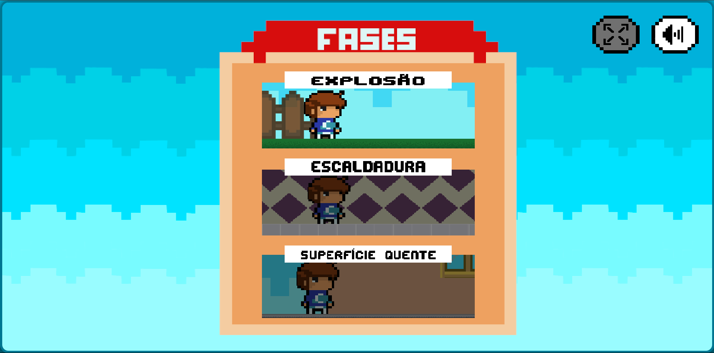
</div>
<div align="center">
<sup>Fonte: Material produzido pelos autores (2024)</sup>
</div>

&nbsp;&nbsp;&nbsp;&nbsp;
No desenvolvimento do projeto, uma adição significativa foi a conclusão do design do mapa para as fases 2 e 3, seguida pela implementação da lógica de código correspondente para tornar o mapa funcional. Além disso, dedicamos esforços para finalizar a mecânica das fases, incluindo novas funcionalidades e aprimoramentos, todos eles relacionados ao código do jogo.

&nbsp;&nbsp;&nbsp;&nbsp;
Com esses aspectos fundamentais concluídos, pudemos expandir as características introduzidas na fase 1 para as fases subsequentes. Isso incluiu a inclusão de elementos como trivias, trilha sonora e bestiários. Adicionalmente, na fase 3, introduzimos um novo elemento: os projéteis, que consistem em bestiários lançados de forma aleatória em diferentes alturas, adicionando um desafio extra ao jogo.

<div align="center">
  <sub>Imagem 30 - Fase 2 </sub>
</div>
<div align="center">
  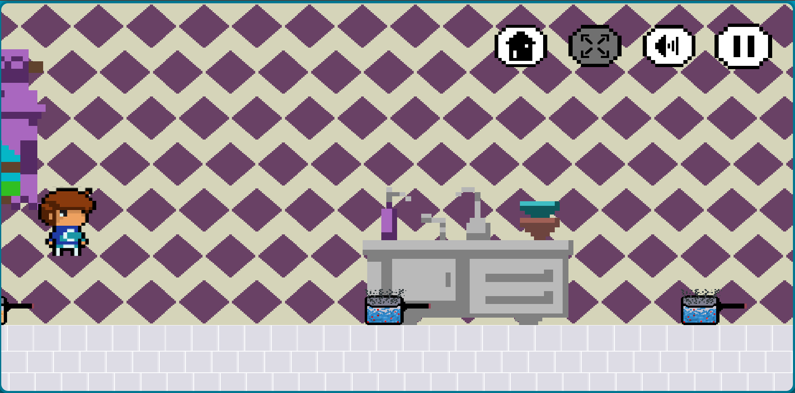
</div>
<div align="center">
<sup>Fonte: Material produzido pelos autores (2024)</sup>
</div>

<div align="center">
  <sub>Imagem 31 - Fase 3 </sub>
</div>
<div align="center">
  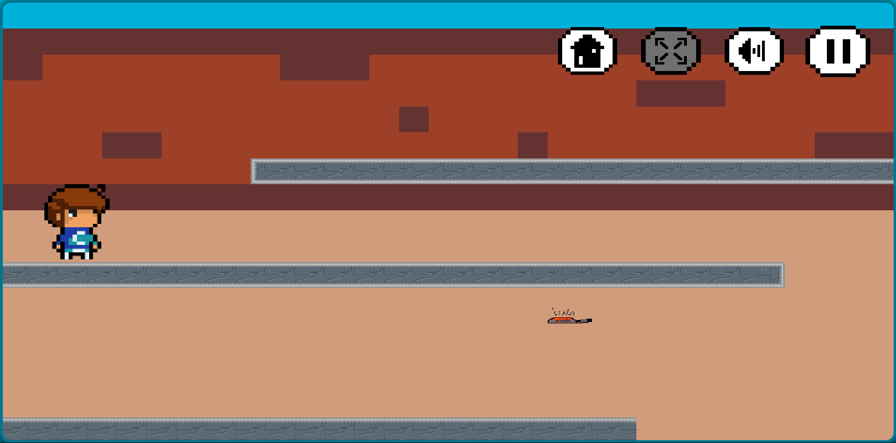
</div>
<div align="center">
<sup>Fonte: Material produzido pelos autores (2024)</sup>
</div>

``` javascript
    // Adiciona elementos visuais em forma de mosaico para compor o cenário
    const map = this.make.tilemap({ key: "map" }); // Cria o mapa

    // Associa as imagens que compõe o mapa com o json
    const map = this.make.tilemap({ key: "map" }); 
    const tilesetGround = map.addTilesetImage("ground", "ground"); // associa a imagem da grama com o json
    const tilesetTile = map.addTilesetImage("tile", "tile");
    const tilesetCabinet = map.addTilesetImage("cabinet", "cabinet");
    const tilesetCabinet1 = map.addTilesetImage("cabinet1", "cabinet1");
    const tilesetWindow = map.addTilesetImage("window", "window");
    const tilesetOven = map.addTilesetImage("oven", "oven");
    const tilesetFreezer = map.addTilesetImage("freezer", "freezer");
    const tilesetTrash = map.addTilesetImage("trash", "trash");
    const tilesetSink = map.addTilesetImage("sink", "sink");
    const tilesetTable = map.addTilesetImage("table", "table");

    // Cria uma camada para cada imagem
    map.createLayer("tile", tilesetTile);
    this.ground = map.createLayer("ground", tilesetGround); 
    this.cabinet = map.createLayer("cabinet", tilesetCabinet);
    this.table = map.createLayer("table", tilesetTable);
    map.createLayer("cabinet1", tilesetCabinet1);
    map.createLayer('window', tilesetWindow);
    map.createLayer("oven", tilesetOven);
    map.createLayer("freezer", tilesetFreezer);
    map.createLayer("trash", tilesetTrash);
    map.createLayer("sink", tilesetSink);

    // Adiciona colisão onde houver a propriedade collider = verdadeiro
    this.ground.setCollisionByProperty({ collider: true }); 
    this.cabinet.setCollisionByProperty({ collider: true });
    this.table.setCollisionByProperty({ collider: true });
```

&nbsp;&nbsp;&nbsp;&nbsp;
Foram implementadas melhorias significativas na cena das trivias. Uma das principais mudanças consistiu na introdução de um feedback mais claro para o jogador ao responder corretamente ou incorretamente uma pergunta. Agora, ao selecionar uma opção, o contorno ao redor da alternativa se torna verde (para respostas corretas) ou vermelho (para respostas incorretas), proporcionando uma resposta visual imediata.

&nbsp;&nbsp;&nbsp;&nbsp;
Além disso, após revelar o resultado da resposta - seja ela certa ou errada -, uma explicação é apresentada na tela, elucidando por que aquela resposta é correta ou incorreta. Essas alterações foram concebidas com o intuito de promover uma maior conscientização por parte do usuário, alinhando-se com os objetivos fundamentais do jogo.

<div align="center">
  <sub>Imagem 32 - Tela com a pergunta da trivia </sub>
</div>
<div align="center">
  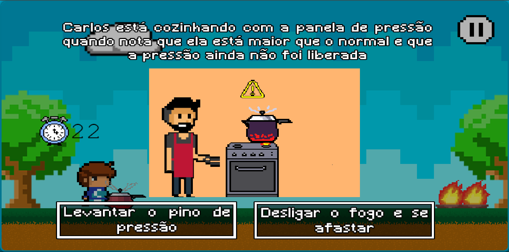
</div>
<div align="center">
<sup>Fonte: Material produzido pelos autores (2024)</sup>
</div>

<div align="center">
  <sub>Imagem 33 - Tela com a resposta da trivia </sub>
</div>
<div align="center">
  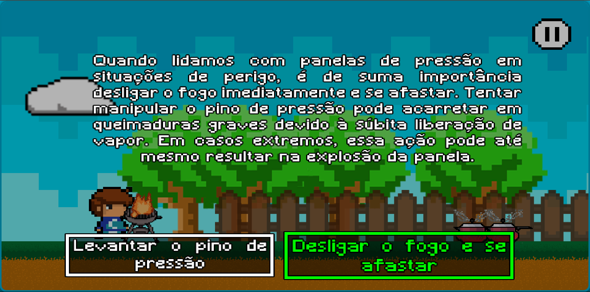
</div>
<div align="center">
<sup>Fonte: Material produzido pelos autores (2024)</sup>
</div>

``` javascript
      // Cria o primeiro quadro de resposta da trivia
      const questao1 = this.add
      .image(this.pos1, 475, "answer1_" + trivia.key) // Adiciona a imagem da pergunta 
      .setScale(1)
      .setInteractive() // Torna a imagem interativa
      .on("pointerdown", () => { // Define uma ação a ser executada quando a imagem for clicada
        if (this.lessonShowed === false) { // Verifica se a lição ainda não foi mostrada
        const lesson = this.add // Adiciona a imagem da lição 
        .image(500, 200, "lesson_" + trivia.key);
        this.lessonShowed = true; // Afirma que a lissão foi mostrada
        triviaImage.destroy(); // Remove a imagem da trivia
        triviaText.destroy(); // Remove o texto da trivia
        this.clockImage.destroy(); // Remove a imagem do relógio
        this.textObject.setVisible(false); 
        questao1.setTint(0x00ff00); // Colore o contorno da pergunta em verde
        this.timeLeft = 11; 
        this.time.delayedCall(10000, () => { // Deixa a lissão em tela por 10 segundos
        gameState.triviaResult = true; // Define o resultado da trivia como verdadeiro
        gameState.triviaAnswered = true; // Marca que a trivia foi respondida
        });
      }
      });

      //Cria o segundo quadro de resposta da trivia
      const questao2 = this.add
      .image(this.pos2, 475, "answer2_" + trivia.key)
      .setScale(1)
      .setInteractive()
      .on("pointerdown", () => {
        if (this.lessonShowed === false) { 
        const lesson = this.add
        .image(500, 200, "lesson_" + trivia.key);
        this.lessonShowed = true;
        triviaImage.destroy();
        triviaText.destroy();
        this.clockImage.destroy();
        this.textObject.setVisible(false);
        questao2.setTint(0xff0000); // Colore o contorno da pergunta em verde
        this.timeLeft = 11; 
        this.time.delayedCall(10000, () => {
        gameState.triviaResult = false; // Define o resultado da trivia como falso
        gameState.triviaAnswered = true;
        });
      }
      });
```

&nbsp;&nbsp;&nbsp;&nbsp;
Por fim, dedicamos esforços para aprimorar a lógica do código de forma abrangente, visando garantir o desempenho ideal do jogo. Realizamos diversas alterações, incluindo a redução do número de linhas, a renomeação de variáveis para melhor clareza e a reestruturação do funcionamento de determinadas classes e funções.

Essas melhorias foram implementadas com o objetivo de tornar o jogo mais ágil, funcional e dinâmico, sem comprometer o aspecto educativo que é fundamental para a proposta do projeto.


# <a id="c5"></a>5. Testes

## 5.1. Casos de Teste

&nbsp;&nbsp;&nbsp;&nbsp;
A seção atual apresenta casos de teste específicos para as funcionalidades já implementadas nas três telas iniciais do jogo "100°C: Corra ou Queime". Estes casos foram desenvolvidos para avaliar a integridade e o funcionamento correto das interações proporcionadas ao usuário nas telas de entrada, escolha de personagem e durante a fase de corrida inicial. Cada caso de teste visa garantir uma experiência de jogo consistente, identificando eventuais falhas e assegurando que as funcionalidades implementadas atendam às expectativas dos jogadores. À medida que novas funcionalidades e telas são adicionadas ao jogo, recomenda-se expandir esta bateria de testes para incluir cobertura abrangente em todas as áreas do desenvolvimento.


<div align="center">
<sub>Tabela H - Relação Casos de Teste </sub>
</div>

\# | pré-condição | descrição do teste | pós-condição
--- | --- | --- | ---
1 | Iniciar o jogo na tela principal | Clicar no botão de iniciar jogo na tela principal e selecionar o Modo História. | Verificar se o jogador é direcionado para a tela de escolha de personagem com o Modo História selecionado
2 | Verificar se o Modo História inicia exclusivamente após clique em seu botão | Clicar em áreas aleatórias da tela, exceto no botão de iniciar Modo História | Tela não deve mudar
3 | Escolher personagem na tela de seleção | Na tela de escolha de personagem, clicar em Celsinho ou Kelvinha | Verificar se o personagem realiza saltos com sucesso
4 |Iniciar o jogo na tela de corrida | Após escolher o personagem, iniciar a tela de corrida e verificar se o personagem se move | Verificar se o jogador é direcionado para a tela de corrida com o personagem em movimento
5 | Tentar iniciar a corrida sem escolher um personagem | Selecionar o Modo História, ir para a tela de escolha de personagem e tentar iniciar a corrida sem escolher um boneco | Verificar se o jogador recebe uma mensagem ou é redirecionado para escolher um personagem antes de iniciar a corrida
6 | Verificar se Modo Rápido está bloqueado | Clicar no botão de iniciar Modo Rápido | Aparecer alerta indicando que Modo está bloqueado no momento
7 | Iniciar o jogo na tela principal | Clicar em qualquer lugar da tela | A música da tela de início deve tocar
8 | Escolher o Celsinho ou a Kelvinha na seleção de personagens | Entrar na tela do jogo | Verificar se a música da tela de início deve parar e a música da cena 1 deve tocar
9 | Estar na tela da fase 1| O usuário deve colidir com algum dos obstáculos | Verificar se a física do jogo parou e se os botões de reinício e de voltar à tela principal estão aparecendo
10 | O usuário deve perder a fase ao colidir com um obstáculo | Clicar no botão de reiniciar o jogo | O jogo deve recomeçar com todos os atributos funcionando
11 | O usuário deve perder a fase ao colidir com um obstáculo | Clicar no botão de voltar à tela de início | Voltar a tela de início e verificar se fatores como a música está funcionando corretamente
12 | Estar na tela da fase 1 | Concluir a fase ao evitar todos os obstáculos | A física do jogo deve parar    
13 | Estar na tela da fase 1 | Apertar a seta para baixo no teclado | Verificar se a animação do jogador agachado está funcionando    


<div align="center">
<sub>Fonte: Material produzido pelos autores (2024)</sub>
</div>

&nbsp;&nbsp;&nbsp;&nbsp;
Os casos de teste elaborados para as três telas iniciais do jogo "100°C: Corra ou Queime" foram projetados para validar a funcionalidade das interações essenciais implementadas até o momento. Ao avaliar a tela principal, a escolha de personagem e a fase inicial de corrida, foi buscado assegurar que o jogo ofereça uma experiência de usuário livre de erros, garantindo o correto encaminhamento entre telas, a escolha adequada de personagem e o movimento do protagonista durante a corrida inicial. Foi concluído que, com a implementação bem-sucedida dessas funcionalidades e a execução bem-sucedida dos casos de teste correspondentes, o desenvolvimento segue um caminho sólido, proporcionando uma base robusta para futuras iterações e expansões do jogo.

## 5.2. Testes de jogabilidade (playtests)

### 5.2.1 Registros de testes

&nbsp;&nbsp;&nbsp;&nbsp;
O playtest é uma etapa vital no desenvolvimento de jogos, envolvendo testes com jogadores reais para obter feedback sobre mecânicas, experiência do usuário e identificar problemas técnicos. Ele é essencial para aprimorar a qualidade do jogo, corrigir bugs e validar decisões de design, garantindo uma experiência envolvente e satisfatória para os jogadores. Ao introduzir a seção de Registros de Testes em um Documento de Design de Jogo (GDD), reconhece-se sua importância fundamental na criação de jogos bem-sucedidos.

**Primeira sessão de testes

| Nome                                     | Joana Maria                                                                                                        |
| ---------------------------------------- | ---------------------------------------------------------------------------------------------------------------------------------------- |
| Já possuía experiência prévia com games? | Sim, é um jogador casual                                                                                                                 |
| Conseguiu iniciar o jogo?                | Sim                                                                                                                                      |
| Entendeu as regras e mecânicas do jogo?  | Não, pela falta de tutorial, existiu uma confusão inicial quanto às regras                                     |
| Conseguiu progredir no jogo?             | Sim                                                                                                                    |
| Apresentou dificuldades?                 | Sim, por conta da mecânica pouco fluida, a jogabilidade ficou um pouco mais dificultosa do que planejado                                                                                  |
| Que nota deu ao jogo?                    | 8.5                                                                                                                                      |
| O que gostou no jogo?                    | Gostou da estética, falou que é um jogo bonito                                             |
| O que poderia melhorar no jogo?          | Poderia haver uma maior curva de dificuldade ao longo das fases e na troca de fases |


| Nome                                     | Mariana Sousa|
| ---------------------------------------- | ---------------------------------------------------------------------------------------------------------------------------------------- |
| Já possuía experiência prévia com games? | Sim, é um jogador casual                                                                                                                 |
| Conseguiu iniciar o jogo?                | Sim                                                                                                                                      |
| Entendeu as regras e mecânicas do jogo?  | Não, houve uma confusão no entendimento da jogabilidade, o que afetou o fluxo de jogo                                     |
| Conseguiu progredir no jogo?             | Não, por conta do mau posicionamento de obstáculos, o teor de dificuldade ficou muito elevado                                                                                                                    |
| Apresentou dificuldades?                 | Sim, acabou sendo difícil de ultrapassar até o primeiro obstáculo                                                                                 |
| Que nota deu ao jogo?                    | 8.0                                                                                                                                      |
| O que gostou no jogo?                    | Achou divertido e jogaria de novo, além disso, também gostou do formato da tela                                             |
| O que poderia melhorar no jogo?          | A mecânica poderia ficar mais fluída e poderia haver adição de um tutorial pré-jogo |

**Segunda sessão de testes

| Nome                                     | Pâmela|
| ---------------------------------------- | ---------------------------------------------------------------------------------------------------------------------------------------- |
| Já possuía experiência prévia com games? | Não                                                                                                          |
| Conseguiu iniciar o jogo?                | Sim                                                                                                                                      |
| Entendeu as regras e mecânicas do jogo?  | Entendeu o tutorial mesmo não achando-o tão claro                                     |
| Conseguiu progredir no jogo?             | Sim                                                                                                                    |
| Apresentou dificuldades?                 | Não                                                                                 |
| Que nota deu ao jogo?                    | 8.0                                                                                                                                      |
| O que gostou no jogo?                    | A dinâmica da corrida misturada com as trivias                                            |
| O que poderia melhorar no jogo?          | Achou que as trivias tinham muito texto e pouco tempo, o que atrapalhou sua experiência |

| Nome                                     | Ueliton |
| ---------------------------------------- | ---------------------------------------------------------------------------------------------------------------------------------------- |
| Já possuía experiência prévia com games? | Sim, é um jogador casual                                                                                                                 |
| Conseguiu iniciar o jogo?                | Sim                                                                                                                                      |
| Entendeu as regras e mecânicas do jogo?  | Sim                   |
| Conseguiu progredir no jogo?             | Sim                                                                                                      |
| Apresentou dificuldades?                 | Foi afetado por um bug nos obstáculos, que o fez ter bater em vários obstáculos sem conseguir desviar                                                                          |
| Que nota deu ao jogo?                    | 9.0                                                                                                                                      |
| O que gostou no jogo?                    | As trivias                                           |
| O que poderia melhorar no jogo?          | O feedback das trivias, ele ficou confuso se acertou ou errou quando respondia as perguntas |

| Nome                                     | Não identificado |
| ---------------------------------------- | ---------------------------------------------------------------------------------------------------------------------------------------- |
| Já possuía experiência prévia com games? | Sim, é um jogador casual                                                                                                                 |
| Conseguiu iniciar o jogo?                | Sim                                                                                                                                      |
| Entendeu as regras e mecânicas do jogo?  | Sim                                     |
| Conseguiu progredir no jogo?             | Sim                                                                                                                    |
| Apresentou dificuldades?                 | Não                                                                                 |
| Que nota deu ao jogo?                    | 7.0                                                                                                                                      |
| O que gostou no jogo?                    | A estética do jogo agradou o jogador                                             |
| O que poderia melhorar no jogo?          | O curva de dificuldade do jogo foi muito baixa, o que desafiou pouco o jogador e não engajou-o na jogatina |

| Nome                                     | Ivan |
| ---------------------------------------- | ---------------------------------------------------------------------------------------------------------------------------------------- |
| Já possuía experiência prévia com games? | Sim, é um jogador casual                                                                                                                 |
| Conseguiu iniciar o jogo?                | Sim                                                                                                                                      |
| Entendeu as regras e mecânicas do jogo?  | Sim                                     |
| Conseguiu progredir no jogo?             | Sim                                                                                                                   |
| Apresentou dificuldades?                 | Não                                                                               |
| Que nota deu ao jogo?                    | 10                                                                                                                                     |
| O que gostou no jogo?                    | Gostou da estética, da música e das corridas                                             |
| O que poderia melhorar no jogo?          | Também sentiu que a curva de dificuldade estava muito baixa, o que o desmotivou de continuar jogando |

### 5.2.2 Melhorias

&nbsp;&nbsp;&nbsp;&nbsp;
Nesta seção serão apresentados as medidas tomadas em relação as críticas recebidas após os casos de teste. 

&nbsp;&nbsp;&nbsp;&nbsp;
O ponto crítico no desenvolvimento intermediário do jogo era a falta de um tutorial que explicasse para o novo jogador o que deveria ser feito. Tanto em relação a mecânica básica do jogo, quanto ao objetivo principal. Em geral, jogadores casuais se sentiam perdidos ao jogar pela primeira vez. Por conta disso, o Double UP desenvolveu um tutorial simples que explica quais os controles presentes no jogo e qual o verdadeiro objetivo.

&nbsp;&nbsp;&nbsp;&nbsp;
Outro ponto que surgiu, decorrente, também, da falta de um tutorial, foi sobre a fluídez da experiência. O jogo fica pouco fluido se fica difícil demais. Nesse contexto, o Double Up se comprometeu a planejar as fases com o plano de fazer o jogo ter um crescimento de dificuldade mais homogêneo.

&nbsp;&nbsp;&nbsp;&nbsp;
Por fim, ressalta-se o compromisso do grupo em desenvolver o jogo para o usuário. As críticas foram todas levadas em consideração pelo time, o qual prontamente se colocou à disposição para solucionar os pontos fracos do projeto.


# <a id="c6"></a>6. Conclusões e trabalhos futuros

&nbsp;&nbsp;&nbsp;&nbsp;
O 100° Celsius: Corra ou Queime é o produto de 10 semanas de intenso trabalho do Double UP. A proposta, como abordada acima, é utilizar o jogo como um incremento à palestra da Faculdade de Medicina da USP, buscando engajar os jovens na pauta da prevenção de queimaduras.

&nbsp;&nbsp;&nbsp;&nbsp;
O Double Up entende que, após 10 semanas, o jogo chega ao seu mínimo produto viável, entregando as principais funcionalidades que o compõem. Sendo elas as corridas, as trívias e os diálogos. 

&nbsp;&nbsp;&nbsp;&nbsp;
Após diversas sessões de teste, o grupo entende os pontos fortes do jogo como o grande fator de diversão de 100° Celsius: Corra ou queima. A maneira como o conteúdo foi inserido na mecânica do jogo, ensinando o usuário de modo intuitivo e casual, sem quebrar sua experiência ao meio como informações muito detalhadas. E o enfoque na prevenção do cotidiano, aproximando as trívias à realidade do público alvo, os adolescentes de escola pública.

&nbsp;&nbsp;&nbsp;&nbsp;
O Double UP, entretanto, tem o dever de apontar pontos de melhoria no projeto. Dada a falta de tempo, o desenvolvimento do jogo cria lacunas que, se ignoradas, podem causar problemas maiores no futuro. Cabe, então, à equipe de desenvolvimento futura a lidar com essas problemas. 

&nbsp;&nbsp;&nbsp;&nbsp;
O ponto principal é a melhoria na modularidade do código, e a redução de sua complexidade. A equipe de desenvolvimento compreende que esses pontos afetam o desempenho do jogo. Nesse sentido, o grupo recomenda um forte trabalho na modularização do código, priorizando reduzir a quantidade de ações que são feitas ao mesmo tempo. Essa medida tem o objetivo de otimizar o jogo para uma experiência mais fluida, principalmente em dispositivos móveis.

&nbsp;&nbsp;&nbsp;&nbsp;
Outro ponto que o Double Up recomenda é o desenvolvimento de mais trivias no jogo, aumentando a quantidade de informação disseminada na experiência. Para isso, o grupo recomenda o uso dos materiais disponibilizados pela própria FMUSP, como o guia de queimaduras. 

&nbsp;&nbsp;&nbsp;&nbsp;
Fica claro, portanto, o compromisso do grupo com o futuro do projeto. E espera-se que, após a leitura deste documento, tenha ficado claro como a ideia surgiu e se desenvolveu. O jogo 100° Celsius: Corra ou Queime é um produto de muito trabalho e dedicação do Double UP, o qual se sente orgulhoso de poder trabalhar em prol da sociedade brasileira na prevenção de queimaduras.

# <a id="c7"></a>7. Referências

Associação Médica Brasileira (AMB). Lançada a demografia médica no Brasil - 2023. Disponível em: <https://amb.org.br/noticias/lancada-a-demografia-medica-no-brasil-2023/>. Acesso em: [7 fevereiro 2024]. <br>

MARINHO, Andréia. Evolução da tecnologia na medicina. Blog iClinic, [s.d.]. Disponível em: <https://blog.iclinic.com.br/evolucao-da-tecnologia-na-medicina/>. Acesso em: [7 fevereiro 2024]. <br>

CARLOS. Luiz. Revista Brasileira de Educação , São Paulo, v. 42, n. 3, p. [Sem Paginação], Setembro de 2018. DOI: 10.1590/1981-52712015v42n3RB20180115EDITORIAL1. Acesso em: [8 fevereiro 2024]. <br>

CASAROTTO, Camila. Como fazer uma análise SWOT. Rock Content, [s.d.]. Disponível em: <https://rockcontent.com/br/blog/como-fazer-uma-analise-swot/>. Acesso em: [8 fevereiro 2024]. <br>

FERREIRA, Kellison. Canvas de proposta de valor. Blog Tera, [s.d.]. Disponível em: <https://blog.somostera.com/product-management/canvas-de-proposta-de-valor>. Acesso em: [13 fevereiro 2024]. <br>

MINETTO, Bianca. Matriz de riscos - Matriz de probabilidade e impacto. Ferramentas da Qualidade, [s.d.]. Disponível em: <https://ferramentasdaqualidade.org/matriz-de-riscos-matriz-de-probabilidade-e-impacto/>. Acesso em: [13 fevereiro 2024]. <br>

DAVITA. Queimaduras. Disponível em: <https://www.davita.com.br/servicos-medicos/davita-saude/queimaduras/>. Acesso em: [20 fevereiro 2024]. <br>

ANHUT, Anjin. Color Theory for Game Design 1: Fundamentals. Howtonotsuckatgamedesign.com, 2014. Disponível em: <http://howtonotsuckatgamedesign.com/2014/11/color-theory-game-design-1-fundamentals/>. Acesso em: [21 fevereiro 2024]. <br>

INSTITUTO BRASILEIRO DE GEOGRAFIA E ESTATÍSTICA (IBGE). "Panorama". Censo 2022, [s.d.]. Disponível em: <https://censo2022.ibge.gov.br/panorama/>. Acesso em: [4 março 2024]. <br>

PORTER, Michael E. Competição: estratégias competitivas essenciais. Gulf Professional Publishing, 1999. <br>

Sharpax. LEVEL DESIGN - Faça da maneira correta. YouTube, [vídeo online]. Disponível em: https://youtu.be/NmFBTvOoqwU?si=r_XE0eP_72Sto4Gk. Acesso em: [27 fevereiro 2024]. <br>


# <a id="c8"></a>Anexos

&nbsp;&nbsp;&nbsp;&nbsp;
Não se aplica nesse projeto.
